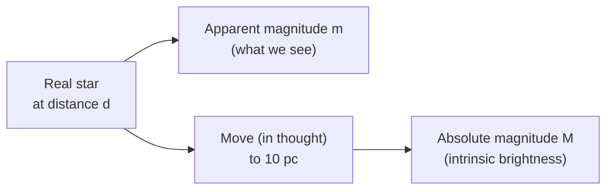

# Absolute Magnitude

## Core Idea

Absolute magnitude `M` is the apparent magnitude a star **would have** if it were placed at a standard distance of **10 parsecs** from Earth. It is a measure of intrinsic brightness, closely tied to [[Luminosity]].

## Symbol

- `M`

## SI Unit

- Dimensionless (logarithmic, same scale as [[Apparent-Magnitude]]).

## Scalar or Vector

- Scalar.

## Definition

Absolute magnitude removes the effect of distance. Two stars with the same `M` have the same true luminosity, regardless of how far away they are or how bright they appear. The relationship between apparent and absolute magnitude is the [[Magnitude-Distance-Equation]]:

`m − M = 5 log₁₀(d / 10)`

where:

- `m` is the [[Apparent-Magnitude]] (dimensionless).
- `M` is the absolute magnitude (dimensionless).
- `d` is the distance to the star, in **parsec (pc)**.

### Distance units

- **Parsec (pc):** the distance at which 1 AU subtends an angle of 1 arcsecond. `1 pc ≈ 3.09 × 10¹⁶ m ≈ 3.26 light years`.
- **Light year (ly):** the distance light travels through vacuum in one year, `≈ 9.46 × 10¹⁵ m`.
- **Astronomical unit (AU):** mean Earth–Sun distance, `≈ 1.496 × 10¹¹ m`.

## How It Is Measured

- Measure `m` directly with photometry.
- Find `d` independently (parallax, [[Standard-Candles]], or Hubble-flow distance).
- Solve the [[Magnitude-Distance-Equation]] for `M`.

## Graphical Meaning

Absolute magnitude is the vertical axis on a [[Hertzsprung-Russell-Diagram]], with the axis inverted so that more luminous stars sit higher.

## Foundation Links

- [[Luminosity]]
- [[Intensity]]

## Related Concepts

- [[Stellar-Spectral-Classes]]
- [[Standard-Candles]]
- [[Stellar-Evolution]]

## Related Laws or Results

- [[Magnitude-Distance-Equation]]
- [[Stefans-Law]]

## Related Experiments

- Parallax measurement of nearby stars to fix `d`.

## Frontier Links

- [[Astronomical-Distances]]
- [[Hubbles-Law]]

## Common Mistakes

- Using `d` in metres or light years in `m − M = 5 log(d/10)` — it **must** be in parsecs.
- Treating `M` as dependent on distance — by construction it is not.
- Forgetting the `−M` sign when rearranging.

## Visuals

### Absolute vs apparent magnitude

*Figure: Absolute magnitude is the brightness the star would show from 10 pc.*
*Source: Authored for this vault (CC0). No external copyright.*

## Watch

- [[Distances-and-Standard-Candles-Crash-Course|Distances: Crash Course Astronomy #25]] — CrashCourse

## Source Trace

- Source: [[AQA-Physics-7407-7408-Specification]] §3.9.2
- Section/Page: Absolute magnitude; parsec; relation to apparent magnitude.
- Public reference: HyperPhysics "Absolute Magnitude"; NASA IPAC distance scale notes.
