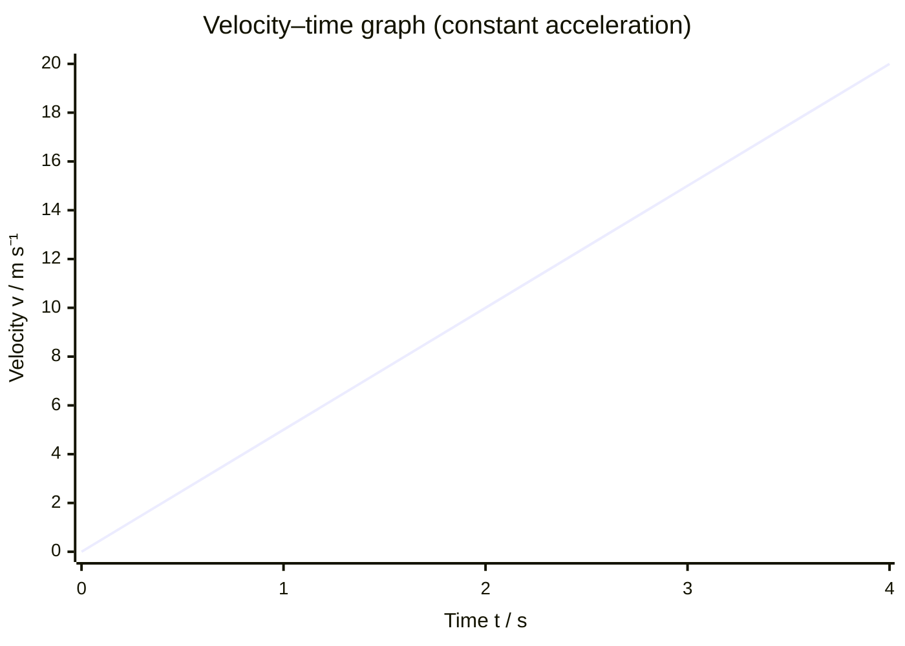

# Acceleration

## Core Idea

Acceleration measures how quickly an object's velocity changes. Because velocity is a vector, an object accelerates if its speed changes, its direction changes, or both. A car speeding up, a car braking, and a car going round a roundabout at constant speed are all accelerating.

## Symbol

`a`

## SI Unit

`m s⁻²` (metres per second per second)

## Scalar or Vector

Vector. It points in the direction of the change in velocity, which is the same direction as the resultant force (Newton's second law). Negative acceleration along the direction of motion means slowing down (deceleration).

## Definition

Acceleration is the rate of change of velocity with time. Average acceleration is the change in velocity divided by the time taken; instantaneous acceleration is the limiting value of this ratio over a very short time interval.

## Related Equations

- $a = \Delta v / \Delta t$ — `a` = acceleration (m s⁻²), `Δv` = change in velocity (m s⁻¹), `Δt` = time interval (s).
- $F = ma$ — `F` = resultant force (N), `m` = mass (kg). See [[Newton-Second-Law]].
- SUVAT equations for **constant** acceleration: $v = u + at$, $s = ut + \frac{1}{2}at^2$, $v^2 = u^2 + 2as$, $s = \frac{1}{2}(u+v)t$ — `s` = displacement (m), `u` = initial velocity (m s⁻¹), `v` = final velocity (m s⁻¹), `t` = time (s).
- `g ≈ 9.81 m s⁻²` is the free-fall acceleration near Earth's surface.

## How It Is Measured

Acceleration is rarely measured directly. Common A-Level approaches:

- **Light gates** on a track: a card of known length through one or two gates gives velocities at known points; `a` follows from $v^2 = u^2 + 2as$ or from $\Delta v/\Delta t$.
- **Ticker timer or motion sensor**: produces position–time data; differentiate twice or take the velocity–time gradient.
- **Video analysis**: frame-by-frame displacement at a known frame rate.

## Graphical Meaning

- On a [[Velocity-Time-Graph]], acceleration is the **gradient**. A straight line means constant acceleration; a curve means changing acceleration.
- On a displacement–time graph, acceleration relates to the **curvature** (a curving line indicates non-zero acceleration).
- On an acceleration–time graph, the **area** under the line gives the change in velocity.

## Foundation Links

- [[From-Speed-to-Velocity]]
- [[From-Distance-to-Displacement]]

## Related Concepts

- [[Velocity]]
- [[Displacement]]
- [[Force]]
- [[Mass]]

## Related Laws or Results

- [[Newton-Second-Law]]
- [[Conservation-of-Momentum]]

## Related Experiments

- Measuring acceleration using light gates or motion sensors
- Measuring free-fall acceleration g

## Frontier Links

- None at A-Level depth (relativistic motion lies beyond scope)

## Common Mistakes

- Confusing acceleration with speed or velocity
- Treating acceleration as a scalar when direction matters
- Assuming acceleration is zero whenever velocity is momentarily zero (e.g. at the top of a vertical throw, $a = g$)
- Applying SUVAT when acceleration is not constant

## Visuals

### Velocity–Time Graph: Gradient = Acceleration

*Figure: A straight line on a v–t graph means constant acceleration; the gradient equals a = Δv/Δt. A steeper line means larger acceleration.*
*Source: Authored for this vault (CC0). No external copyright.*

## Source Trace

- Source: OpenStax College Physics; The Physics Classroom; HyperPhysics (paraphrased, no copied text)
- OCR alignment: [[OCR-Physics-A-H556-Specification]]
