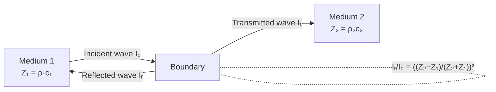

# Acoustic Impedance

## Core Idea

Acoustic impedance describes how strongly a medium resists the passage of a sound wave; the mismatch in acoustic impedance between two tissues controls how much ultrasound is reflected at their boundary, which is the basis of [[Ultrasound-Imaging]].

## Symbol

- $Z$

## SI Unit

- $\text{kg m}^{-2}\,\text{s}^{-1}$ (often written as the rayl).

## Scalar or Vector

- Scalar.

## Definition

The specific acoustic impedance of a medium is the product of its density and the speed of sound in it:

$$Z = \rho c$$

where $\rho$ is the density ($\text{kg m}^{-3}$) and $c$ is the speed of sound in the medium ($\text{m s}^{-1}$).

## Related Equations

- Intensity reflection coefficient at a boundary between media of impedance $Z_1$ and $Z_2$:

$$\frac{I_r}{I_0} = \left(\frac{Z_2 - Z_1}{Z_2 + Z_1}\right)^{2}$$

- A large impedance mismatch (e.g. soft tissue to air or to bone) gives strong reflection; a small mismatch transmits most energy. This is why a coupling gel is used to exclude air in [[Ultrasound-Imaging]].

## How It Is Measured

$Z$ is calculated from separately measured density and speed of sound rather than measured directly. Speed of sound in a sample can be found from echo timing over a known path length.

## Graphical Meaning

Plotting $I_r/I_0$ against the impedance ratio $Z_2/Z_1$ shows reflection is minimal when the ratio is near 1 and rises sharply as the mismatch grows.

## Foundation Links

- [[Wave-Refraction]]

## Related Concepts

- [[Intensity]]

## Related Laws or Results

- [[Snell-Law]]

## Related Experiments

- [[Ultrasound-Imaging]]

## Frontier Links

- Impedance-matching layers in transducer design extend this idea; beyond A-Level.

## Common Mistakes

- Confusing acoustic impedance with electrical impedance.
- Forgetting to square the bracket in the reflection coefficient.
- Assuming bone reflects little — its high $Z$ gives a large mismatch with soft tissue.

## Visuals

### Reflection at an Impedance Boundary

*Figure: When a wave crosses from medium 1 to medium 2, the fraction of intensity reflected depends on the impedance mismatch. A large mismatch (e.g. tissue-to-air) reflects most energy; a small mismatch transmits most.*
*Source: Authored for this vault (CC0). No external copyright.*

## Source Trace

- Source: OpenStax College Physics; HyperPhysics; IOPSpark
- OCR alignment: [[OCR-Physics-A-H556-Specification]]
