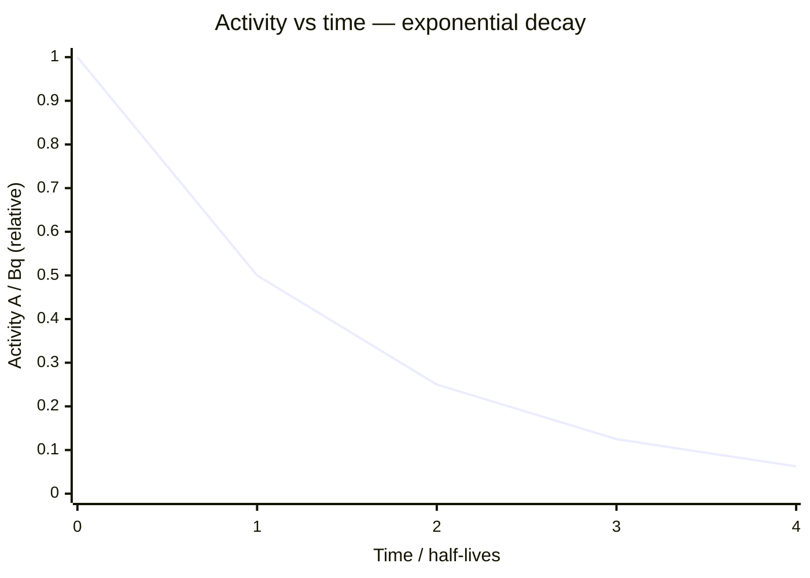

# Activity

## Core Idea

Activity is the rate at which nuclei in a radioactive sample decay — how many disintegrations happen each second.

## Symbol

- A

## SI Unit

- becquerel (Bq), where 1 Bq = 1 decay per second (units of s⁻¹)

## Scalar or Vector

- Scalar

## Definition

Activity is the number of nuclear decays per unit time. It is proportional to both the [[Decay-Constant]] λ and the number of undecayed nuclei N present:

$$A = \lambda N$$

Since N falls exponentially, so does activity: $A = A_0 e^{-\lambda t}$, with $A_0$ the initial activity.

## Related Equations

- $A = \lambda N$
- $A = A_0 e^{-\lambda t}$
- $t_{1/2} = \ln 2 / \lambda$  (via [[Half-Life]])

## How It Is Measured

A Geiger–Müller tube and counter records detected decays over a measured time, after subtracting **background count**. The detected count rate is lower than true activity because detectors capture only a fraction of emissions over the solid angle they subtend.

## Graphical Meaning

A against t is an exponential decay curve. ln A against t is a straight line of gradient −λ; the intercept gives ln A₀. The activity halves every [[Half-Life]].

## Foundation Links

- [[Atomic-Structure]]
- [[Isotopes]]

## Related Concepts

- [[Radioactive-Decay]]

## Related Laws or Results

- [[Radioactive-Decay-Law]]

## Related Experiments

- [[Modelling-Radioactive-Decay]]

## Frontier Links

- [[Particle-Physics-Map]]

## Common Mistakes

- Forgetting to subtract background count rate
- Confusing measured count rate with true activity
- Mixing time units between A, λ, and t

## Visuals

### Exponential Decay of Activity

*Figure: Activity halves every half-life (t½ = ln 2 / λ). The curve is A = A₀ e^(−λt). On a ln A vs t graph this becomes a straight line of gradient −λ.*
*Source: Authored for this vault (CC0). No external copyright.*

## Source Trace

- Source: OpenStax College Physics; HyperPhysics; CERN educational material — no copied text
- OCR alignment: [[OCR-Physics-A-H556-Specification]]
