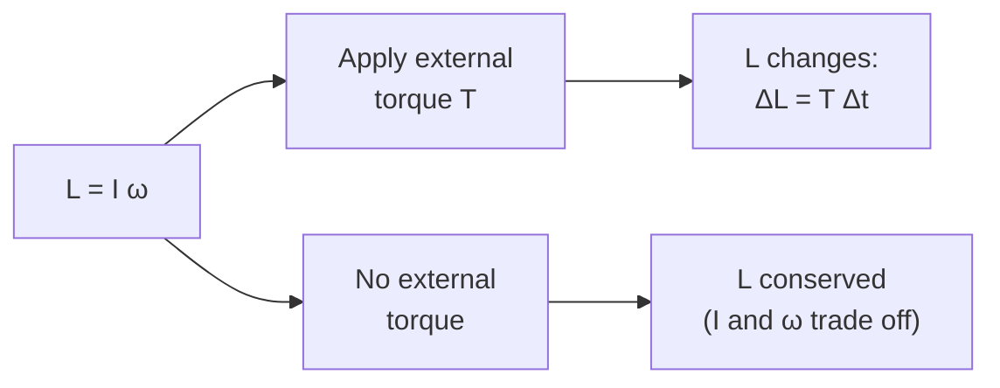

# Angular Momentum

## Core Idea

Angular momentum measures how much rotational motion a body carries. It is the rotational analogue of linear [[Momentum]]: where $p = mv$ captures "how hard it is to stop something moving in a line", $L = I\omega$ captures "how hard it is to stop something spinning".

## Symbol

- $L$

## SI Unit

- $\mathrm{kg\,m^{2}\,s^{-1}}$ — equivalently N m s (since 1 N m s = 1 kg m² s⁻¹).

## Scalar or Vector

- Vector along the rotation axis (direction given by the right-hand rule). For AQA Engineering Physics, calculations are about a fixed axis, so $L$ is treated as a signed scalar — clockwise vs anticlockwise.

## Definition

For a rigid body rotating about a fixed axis:

$$
L = I \omega
$$

- $I$: [[Moment-of-Inertia]] about the rotation axis, $\mathrm{kg\,m^{2}}$.
- $\omega$: [[Angular-Velocity]], rad s⁻¹ (see [[Radian]]).
- Axis: $I$ must be taken about the axis you are using for $\omega$.

## Related Equations

- Linear analogue: $p = m v$ — see [[Momentum]].
- Conservation: $L_\text{before} = L_\text{after}$ when net external torque is zero — see [[Conservation-of-Angular-Momentum]].
- Angular impulse (for constant torque): $T\,\Delta t = \Delta L = \Delta(I\omega)$ — rotational version of impulse = change in momentum.
- Rotational kinetic energy in terms of $L$: $E_k = \dfrac{L^{2}}{2I}$.

## How It Is Measured

Usually computed from measured $I$ and $\omega$ rather than measured directly. In a closed system (e.g. a spinning platform with rearrangeable masses), measuring $\omega$ before and after a rearrangement and using conservation lets you check or determine $I$ values.

## Graphical Meaning

On a graph of $L$ against $\omega$ for a body of fixed $I$, the gradient is $I$. On an $L$–$t$ graph during a constant applied torque, the gradient equals the net torque $T$.

## Foundation Links

- [[Momentum]]
- [[Mass]]
- [[Circular-Motion]]

## Related Concepts

- [[Rotational-Motion]]
- [[Rotational-Kinetic-Energy]]

## Related Laws or Results

- [[Conservation-of-Angular-Momentum]]
- [[Conservation-of-Momentum]]
- [[Torque-and-Angular-Acceleration]]
- [[Newton-Second-Law]]

## Related Experiments

- [[...]]

## Frontier Links

- [[...]]

## Common Mistakes

- Quoting $L$ without stating the axis — like $I$, it is axis-dependent.
- Forgetting it is a **vector**: opposite spin directions cancel, not add.
- Confusing $L = I\omega$ with linear $p = mv$ when an object moves *and* spins — they are separate accounts.
- Assuming $L$ is conserved when there is an external torque (e.g. friction in a bearing): only the absence of net external torque guarantees conservation.

## Visuals

### Two ways to change angular momentum

*Figure: Angular momentum changes only when there is a net external torque; otherwise I and ω can change while their product stays constant.*
*Source: Authored for this vault (CC0). No external copyright.*

## Source Trace

- Source: [[AQA-Physics-7407-7408-Specification]] §3.11.1 (Engineering Physics — Rotational dynamics)
- Section/Page: Public reference — HyperPhysics; OpenStax College Physics
