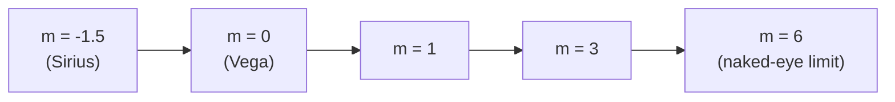

# Apparent Magnitude

## Core Idea

Apparent magnitude `m` is a number that describes how bright a star looks **from Earth**, not how bright it actually is.

## Symbol

- `m`

## SI Unit

- Dimensionless (it is a logarithmic ratio of [[Intensity]]).

## Scalar or Vector

- Scalar.

## Definition

Apparent magnitude is a logarithmic measure of the radiant flux (energy per second per square metre) arriving at Earth from a star. The Hipparcos scale was defined so that the dimmest stars visible to the naked eye on a clear, dark night have `m ≈ 6`, while the brightest stars in the sky have `m ≈ 1` or lower. **Smaller (or more negative) `m` means brighter.**

A difference of 1 magnitude corresponds to an [[Intensity]] ratio of about `2.51` (the fifth root of 100). A difference of 5 magnitudes therefore corresponds to a factor of exactly 100 in intensity:

`I_1 / I_2 = 2.51^(m_2 − m_1)`

where:

- `I_1`, `I_2` are the intensities reaching Earth, in `W m⁻²`.
- `m_1`, `m_2` are the apparent magnitudes (dimensionless).

## How It Is Measured

Apparent magnitudes are measured with calibrated CCD photometry through standard filter bands (e.g. V band). The detector output is compared against catalogued reference stars of known magnitude.

## Graphical Meaning

If you plot apparent magnitude on a vertical axis, the convention is to **invert** the axis so that brighter stars sit higher up. The same applies to the vertical axis of a [[Hertzsprung-Russell-Diagram]] when it is drawn with magnitude.

## Foundation Links

- [[Intensity]]
- [[Luminosity]]

## Related Concepts

- [[Stellar-Spectral-Classes]]
- [[Black-Body-Radiation]]

## Related Laws or Results

- [[Magnitude-Distance-Equation]]

## Related Experiments

- Calibrated photometry of standard stars.

## Frontier Links

- [[Astronomical-Distances]]

## Common Mistakes

- Treating "larger magnitude" as "brighter" — it is the opposite.
- Confusing apparent brightness (depends on distance) with intrinsic [[Luminosity]] — see [[Absolute-Magnitude]].
- Forgetting that the scale is logarithmic: `Δm = 1` is a factor of `2.51` in intensity, not a small linear change.

## Visuals

### Apparent magnitude scale

*Figure: Apparent magnitude increases as observed brightness decreases.*
*Source: Authored for this vault (CC0). No external copyright.*

## Watch

- [[How-Do-You-Measure-the-Universe-PBS-Space-Time|How Do You Measure the Size of the Universe?]] — PBS Space Time

## Source Trace

- Source: [[AQA-Physics-7407-7408-Specification]] §3.9.2
- Section/Page: Classification of stars by luminosity; apparent magnitude scale.
- Public reference: HyperPhysics "Magnitude Scale"; OpenStax Astronomy Ch. 17.
