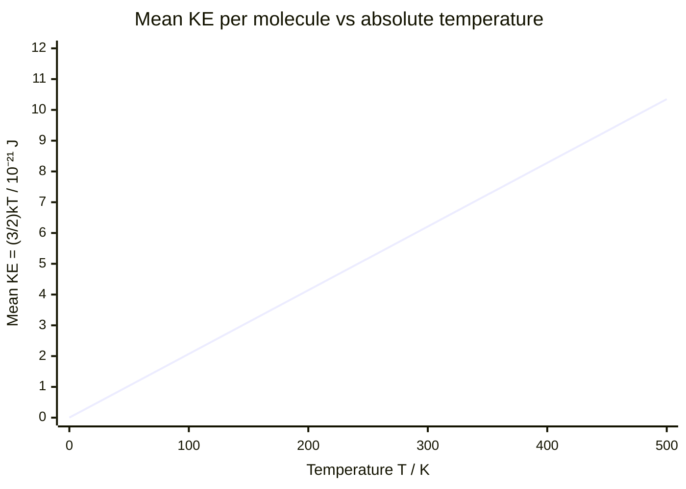

# Boltzmann Constant

## Core Idea

The Boltzmann constant is the proportionality constant linking the average random kinetic energy of a single particle to its thermodynamic temperature.

## Symbol

- $k$ (sometimes $k_B$)

## SI Unit

- J K⁻¹

## Scalar or Vector

- Scalar (a physical constant)

## Definition

The Boltzmann constant is the gas constant per molecule:

$$ k = \frac{R}{N_A} $$

where $R$ is the molar gas constant (J mol⁻¹ K⁻¹) and $N_A$ is the Avogadro constant (mol⁻¹). Its value is approximately $k = 1.38 \times 10^{-23}\ \mathrm{J\,K^{-1}}$.

## Related Equations

$$ pV = NkT \qquad \tfrac{1}{2}m\overline{c^{2}} = \tfrac{3}{2}kT $$

The first is the [[Ideal-Gas-Equation]] written per molecule ($N$ = number of molecules); the second gives the mean translational kinetic energy of a gas molecule from [[Kinetic-Theory-of-Gases]], where $m$ is molecular mass (kg), $\overline{c^{2}}$ is mean square speed (m² s⁻²) and $T$ is thermodynamic [[Temperature]] (K).

## How It Is Measured

Not measured directly; obtained from $k = R/N_A$ using the experimentally determined molar gas constant and Avogadro constant. (Since the 2019 SI redefinition, $k$ has a fixed defined value.)

## Graphical Meaning

A graph of mean molecular kinetic energy against thermodynamic temperature is a straight line through the origin with gradient $\frac{3}{2}k$. A graph of $pV$ against $T$ for $N$ molecules has gradient $Nk$.

## Foundation Links

- [[Energy-Quantity|Energy]]
- [[Temperature]]

## Related Concepts

- [[Kinetic-Theory-of-Gases]]
- [[Internal-Energy]]
- [[Absolute-Zero]]

## Related Laws or Results

- [[Ideal-Gas-Equation]]

## Related Experiments

- Determination via gas-law $pV$ versus $T$ measurements

## Frontier Links

- Entropy $S = k\ln\Omega$ in statistical mechanics (orientation only, beyond A-Level)

## Common Mistakes

- [[Confusing-Heat-and-Temperature]]
- Confusing the Boltzmann constant $k$ with the molar gas constant $R$
- Using molar quantities with $k$ instead of $R$

## Visuals

### Mean Molecular Kinetic Energy vs Temperature

*Figure: Mean translational KE = (3/2)kT is directly proportional to absolute temperature. The gradient of this straight line through the origin equals (3/2)k ≈ 2.07 × 10⁻²³ J K⁻¹. The line passes through the origin — at 0 K, mean KE is zero (absolute zero).*
*Source: Authored for this vault (CC0). No external copyright.*

### From Wikipedia

<!-- wiki-images: yes -->

#### Boltzmann2

![[_attachments/03_Physical-Quantities/Boltzmann-Constant--wiki-boltzmann2.jpg]]
*Figure: from Wikipedia article "Boltzmann constant".*
*Source: Wikimedia Commons — [Boltzmann2.jpg](https://commons.wikimedia.org/wiki/File:Boltzmann2.jpg). Retrieved 2026-05-20.*

#### Ideal gas law relationships

![[_attachments/03_Physical-Quantities/Boltzmann-Constant--wiki-ideal-gas-law-relationships.svg]]
*Figure: from Wikipedia article "Boltzmann constant".*
*Source: Wikimedia Commons — [Ideal gas law relationships.svg](https://commons.wikimedia.org/wiki/File:Ideal_gas_law_relationships.svg). Retrieved 2026-05-20.*

#### Max Planck by Hugo Erfurth 1938cr - restoration1

![[_attachments/03_Physical-Quantities/Boltzmann-Constant--wiki-max-planck-by-hugo-erfurth-1938cr-restor.jpg]]
*Figure: from Wikipedia article "Boltzmann constant".*
*Source: Wikimedia Commons — [Max Planck by Hugo Erfurth 1938cr - restoration1.jpg](https://commons.wikimedia.org/wiki/File:Max_Planck_by_Hugo_Erfurth_1938cr_-_restoration1.jpg). Retrieved 2026-05-20.*

## Source Trace

- Source: OpenStax College Physics; HyperPhysics; The Physics Classroom — paraphrased, no copied text
- Section/Page: OCR alignment: [[OCR-Physics-A-H556-Specification]] (Module 5.1.3–5.1.4)
