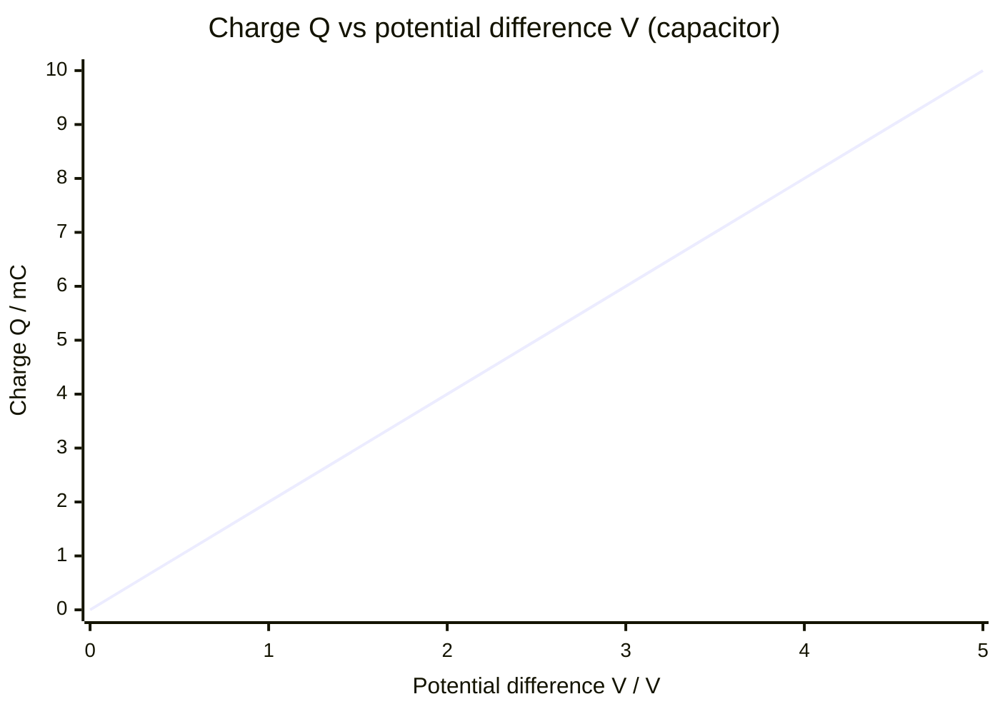

# Capacitance

## Core Idea

Capacitance measures how much charge a capacitor can store for each volt applied across it. A large capacitance stores a lot of charge at modest voltage. Capacitors store energy in an electric field and release it quickly, which is why they are used in flashguns, timing circuits and smoothing.

## Symbol

`C`

## SI Unit

`F` (farad). `1 F = 1 C V⁻¹`. Practical values are usually µF, nF or pF.

## Scalar or Vector

Scalar. Magnitude only; positive.

## Definition

Capacitance is the charge stored per unit potential difference across a capacitor.

## Related Equations

- $C = Q / V$ — `C` = capacitance (F), `Q` = charge (C), `V` = p.d. (V).
- Energy stored: $E = \frac{1}{2}QV = \frac{1}{2}CV^2 = \frac{1}{2}Q^2/C$ (J).
- Discharge: $Q = Q_0 e^{-t/RC}$ — `R` = resistance (Ω), `t` = time (s); time constant $\tau = RC$ (s).
- Parallel: $C_{total} = C_1 + C_2 + \dots$. Series: $1/C_{total} = 1/C_1 + 1/C_2 + \dots$.

## How It Is Measured

Charge the capacitor to a known p.d., measure stored charge (coulombmeter, or $Q = It$ by discharging at constant current), and use $C = Q/V$. Alternatively, find `C` from the time constant $RC$ of an exponential discharge curve with a known resistor.

## Graphical Meaning

A charge–p.d. graph for a capacitor is a straight line through the origin; the **gradient is the capacitance** and the **area under it is the energy stored** ($\frac{1}{2}QV$). A discharge $\ln Q$ vs $t$ graph is linear with gradient $-1/RC$.

## Foundation Links

- [[Energy-Quantity|Energy]] (GCSE-Foundations layer — energy storage)

## Related Concepts

- [[Charge]]
- [[Potential-Difference]]
- [[Electric-Field-Strength]]
- [[Energy-Quantity|Energy]]

## Related Laws or Results

- [[Ohms-Law]]

## Related Experiments

- Investigating capacitor discharge and finding the time constant

## Frontier Links

- [[Semiconductor-Physics-Map]] (capacitance in microelectronics — orientation only)

## Common Mistakes

- Forgetting the factor ½ in stored-energy formulae
- Confusing the time constant `RC` with a half-life
- Adding capacitors with the wrong (resistor-like) series/parallel rule

## Visuals

### Charge–Voltage Graph: Gradient = Capacitance, Area = Energy

*Figure: The gradient of the Q–V graph is the capacitance C = Q/V (here, gradient = 2 mC/V = 2 mF). The triangular area under the line is the energy stored E = ½QV = ½CV². Steeper gradient means larger capacitance.*
*Source: Authored for this vault (CC0). No external copyright.*

## Source Trace

- Source: OpenStax College Physics; The Physics Classroom; HyperPhysics (paraphrased, no copied text)
- OCR alignment: [[OCR-Physics-A-H556-Specification]]
