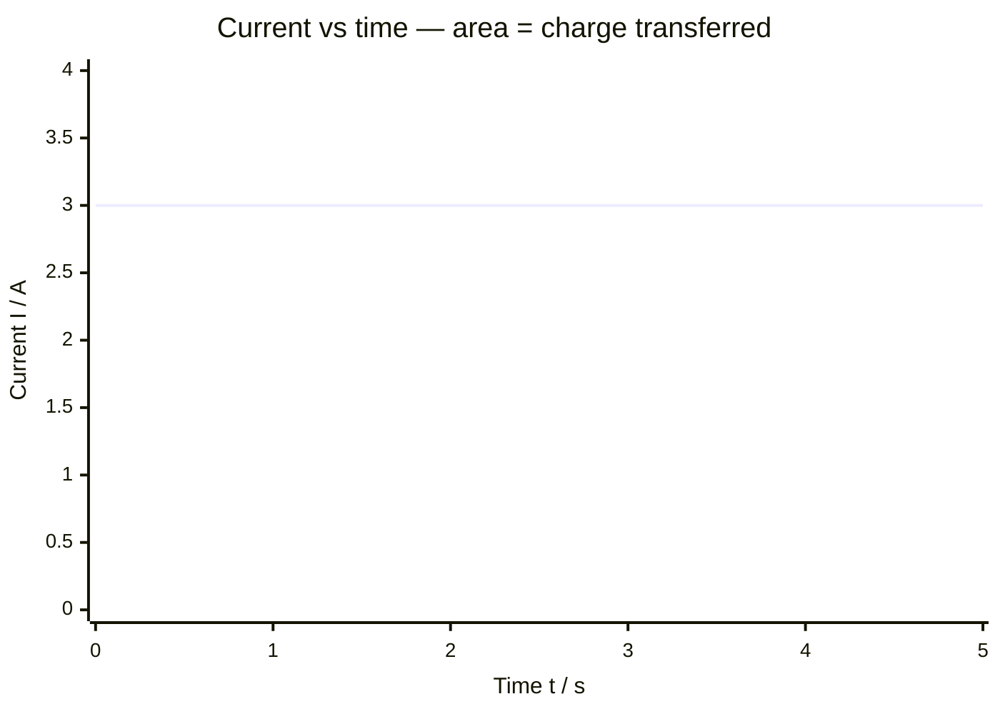

# Charge

## Core Idea

Electric charge is the property of matter responsible for electrical forces. It comes in two kinds (positive and negative), is carried by particles such as electrons and ions, and is quantised — it always comes in whole multiples of the elementary charge `e`. Moving charge is electric current.

## Symbol

`Q` (or `q`)

## SI Unit

`C` (coulomb). `1 C = 1 A s`. Elementary charge `e ≈ 1.60 × 10⁻¹⁹ C`.

## Scalar or Vector

Scalar (signed: positive or negative). The *force* it experiences in a field is a vector.

## Definition

Charge is a conserved physical property that determines the electromagnetic force on a particle; one coulomb is the charge transported by a current of one ampere in one second.

## Related Equations

- $Q = It$ — `Q` = charge (C), `I` = current (A), `t` = time (s).
- $Q = ne$ — `n` = number of elementary charges, `e` = 1.60 × 10⁻¹⁹ C.
- $W = QV$ — energy transferred (J), `V` = potential difference (V).
- Capacitor: $Q = CV$ — `C` = capacitance (F). See [[Capacitance]].
- Force between charges: see [[Coulombs-Law]].

## How It Is Measured

Indirectly: charge = current × time (ammeter and timer), or from $Q = CV$ using a capacitor of known capacitance, or with a coulombmeter. In the Millikan-type context, charge is inferred from force balance on droplets.

## Graphical Meaning

On a current–time graph, the **area under the curve** equals the charge that has flowed. On a charge–p.d. graph for a capacitor, the gradient is the capacitance.

## Foundation Links

- [[From-Weight-to-Gravitational-Field-Strength]] (analogy: field acting on a property)

## Related Concepts

- [[Current]]
- [[Potential-Difference]]
- [[Capacitance]]
- [[Electric-Field-Strength]]

## Related Laws or Results

- [[Coulombs-Law]]
- [[Ohms-Law]]

## Related Experiments

- Charging a capacitor and measuring stored charge

## Frontier Links

- [[Particle-Physics-Map]] (charge of quarks and leptons)

## Common Mistakes

- Forgetting charge is signed
- Confusing charge with current (current is the *rate* of charge flow)
- Forgetting charge is quantised in units of `e`

## Visuals

### Current–Time Graph: Area = Charge

*Figure: For a steady current of 3 A, the area under the I–t graph (the rectangle) equals the charge Q = I × t = 3 × 5 = 15 C. For a varying current, Q is the total area under the curve.*
*Source: Authored for this vault (CC0). No external copyright.*

## Source Trace

- Source: OpenStax College Physics; The Physics Classroom; HyperPhysics (paraphrased, no copied text)
- OCR alignment: [[OCR-Physics-A-H556-Specification]]
