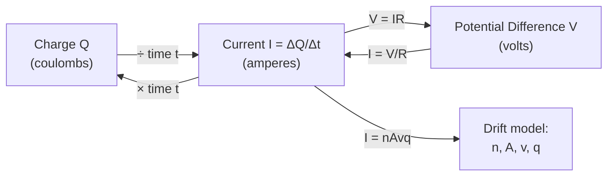

# Current

## Core Idea

Electric current is the rate of flow of electric charge — how many coulombs pass a point each second. In a metal it is a drift of free electrons; conventional current is defined as the direction positive charge would flow (opposite to electron flow). Current is the same at every point in a single series loop.

## Symbol

`I`

## SI Unit

`A` (ampere) — a base SI unit. `1 A = 1 C s⁻¹`.

## Scalar or Vector

Scalar at A-Level (treated with a direction/sign in circuits but not as a true vector).

## Definition

Electric current is the rate of flow of electric charge past a point.

## Related Equations

- $I = \Delta Q / \Delta t$ — `I` = current (A), `ΔQ` = charge (C), `Δt` = time (s).
- $I = nAvq$ — `n` = charge-carrier number density (m⁻³), `A` = cross-sectional area (m²), `v` = drift velocity (m s⁻¹), `q` = carrier charge (C).
- $V = IR$ — `V` = p.d. (V), `R` = resistance (Ω). See [[Ohms-Law]].
- Kirchhoff's first law: total current in = total current out at a junction.

## How It Is Measured

An ammeter connected **in series** with the component (ideal ammeter has negligible resistance). Small currents may be measured with a galvanometer or milliammeter; data-loggers give time-varying current.

## Graphical Meaning

On an [[IV-Characteristic]], current is plotted against p.d.; the gradient gives $1/R$ (for an ohmic conductor, a straight line through the origin). The area under a current–time graph is the charge transferred.

## Foundation Links

- [[Energy-Quantity|Energy]] (GCSE-Foundations layer — energy transfer in circuits)

## Related Concepts

- [[Charge]]
- [[Potential-Difference]]
- [[Resistance]]
- [[Resistivity]]

## Related Laws or Results

- [[Ohms-Law]]

## Related Experiments

- [[Determining-Internal-Resistance]]

## Frontier Links

- [[Semiconductor-Physics-Map]] (current in semiconductors)

## Common Mistakes

- Connecting the ammeter in parallel
- Confusing conventional current direction with electron flow
- Thinking current "gets used up" around a circuit

## Visuals

### How Current Relates to Charge Flow

*Figure: Current I is the rate of charge flow. It links upward to charge (Q = It) and laterally to p.d. via Ohm's law. The drift model I = nAvq shows how carrier density, cross-section, drift speed and charge determine macroscopic current.*
*Source: Authored for this vault (CC0). No external copyright.*

### From Wikipedia

<!-- wiki-images: yes -->

#### Current notation

![[_attachments/03_Physical-Quantities/Current--wiki-current-notation.svg]]
*Figure: from Wikipedia article "Electric current".*
*Source: Wikimedia Commons — [Current notation.svg](https://commons.wikimedia.org/wiki/File:Current_notation.svg). Retrieved 2026-05-20.*

#### Electromagnetic induction - solenoid to loop - animation

![[_attachments/03_Physical-Quantities/Current--wiki-electromagnetic-induction-solenoid-to-lo.gif]]
*Figure: from Wikipedia article "Electric current".*
*Source: Wikimedia Commons — [Electromagnetic induction - solenoid to loop - animation.gif](https://commons.wikimedia.org/wiki/File:Electromagnetic_induction_-_solenoid_to_loop_-_animation.gif). Retrieved 2026-05-20.*

#### Magnetic field produced by an electric current in a solenoid

![[_attachments/03_Physical-Quantities/Current--wiki-magnetic-field-produced-by-an-electric-c.png]]
*Figure: from Wikipedia article "Electric current".*
*Source: Wikimedia Commons — [Magnetic field produced by an electric current in a solenoid.png](https://commons.wikimedia.org/wiki/File:Magnetic_field_produced_by_an_electric_current_in_a_solenoid.png). Retrieved 2026-05-20.*

## Source Trace

- Source: OpenStax College Physics; The Physics Classroom; HyperPhysics (paraphrased, no copied text)
- OCR alignment: [[OCR-Physics-A-H556-Specification]]
