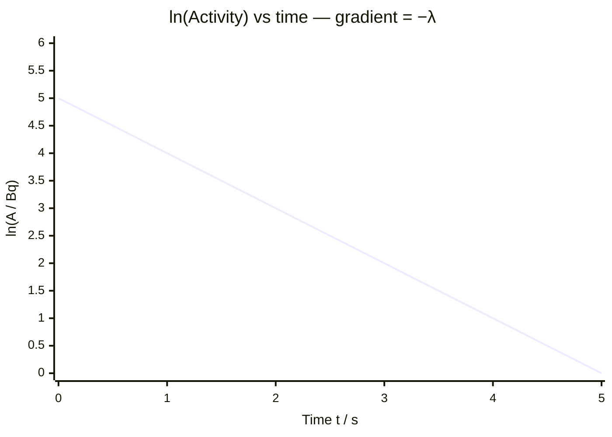

# Decay Constant

## Core Idea

The decay constant measures how likely a given unstable nucleus is to decay per unit time — a fixed property of each radioisotope.

## Symbol

- λ (lambda)

## SI Unit

- per second, s⁻¹ (also h⁻¹, yr⁻¹ in practice)

## Scalar or Vector

- Scalar

## Definition

The decay constant λ is the probability per unit time that an individual nucleus will decay. For a large number N of nuclei, the rate of decay is proportional to N:

$$\Delta N/\Delta t = -\lambda N$$

This is the basis of the [[Radioactive-Decay-Law]], whose solution is $N = N_0 e^{-\lambda t}$.

## Related Equations

- $A = \lambda N$  (links to [[Activity]])
- $t_{1/2} = \ln 2 / \lambda$  (links to [[Half-Life]])
- $N = N_0 e^{-\lambda t}$

## How It Is Measured

Measure [[Activity]] A and number of nuclei N (or measure how activity falls with time) and use $\lambda = A/N$, or determine [[Half-Life]] from a decay curve and compute $\lambda = \ln 2 / t_{1/2}$.

## Graphical Meaning

On a graph of ln N (or ln A) against time, the line is straight with gradient −λ. The steeper the decline, the larger λ and the more unstable the isotope.

## Foundation Links

- [[Atomic-Structure]]
- [[Isotopes]]

## Related Concepts

- [[Radioactive-Decay]]

## Related Laws or Results

- [[Radioactive-Decay-Law]]

## Related Experiments

- [[Modelling-Radioactive-Decay]]

## Frontier Links

- [[Particle-Physics-Map]]

## Common Mistakes

- Confusing λ (probability per unit time) with [[Half-Life]] (a time)
- Using inconsistent time units between λ and t
- Forgetting the minus sign in $\Delta N/\Delta t = -\lambda N$

## Visuals

### ln A vs Time: Gradient = −λ

*Figure: Plotting ln A against t converts the exponential decay into a straight line. The gradient equals −λ (the decay constant). The steeper the decline, the larger λ and the less stable the isotope. The y-intercept gives ln A₀.*
*Source: Authored for this vault (CC0). No external copyright.*

## Source Trace

- Source: OpenStax College Physics; HyperPhysics; CERN educational material — no copied text
- OCR alignment: [[OCR-Physics-A-H556-Specification]]
