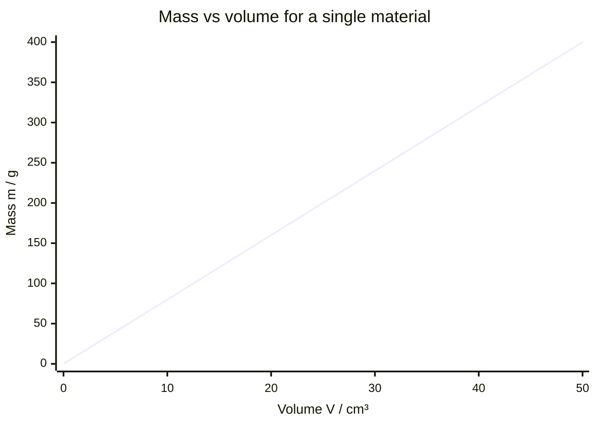

# Density

## Core Idea

Density tells you how much mass is packed into a given volume. It explains why a small lead sinker feels heavy while a large polystyrene block feels light, and why some objects float while others sink.

## Symbol

`ρ` (Greek rho)

## SI Unit

`kg m⁻³` (commonly also g cm⁻³ in the lab; 1 g cm⁻³ = 1000 kg m⁻³)

## Scalar or Vector

Scalar. Magnitude only; always positive.

## Definition

Density is the mass per unit volume of a substance.

## Related Equations

- $\rho = m / V$ — `ρ` = density (kg m⁻³), `m` = mass (kg), `V` = volume (m³).
- $m = \rho V$ and $V = m/\rho$ (rearrangements).
- Floating condition: an object floats when its mean density is less than that of the fluid.

## How It Is Measured

Measure mass with a balance and volume by geometry (regular solid: measure dimensions) or by displacement of liquid (irregular solid: change in measuring-cylinder reading). For a liquid, weigh a known volume in a measuring cylinder. Combine using $\rho = m/V$, with uncertainties propagated from each measurement.

## Graphical Meaning

A plot of mass against volume for a single material is a straight line through the origin; its gradient is the density.

## Foundation Links

- [[Mass]]

## Related Concepts

- [[Mass]]
- [[Pressure]]
- [[Volume]]

## Related Laws or Results

- None directly (defining relationship)

## Related Experiments

- Determining the density of a regular and an irregular solid

## Frontier Links

- [[Cosmology-Map]] (critical density of the universe — orientation only)

## Common Mistakes

- Mixing g cm⁻³ and kg m⁻³ without converting
- Confusing density with weight or with mass
- Measuring volume incorrectly for irregular solids

## Visuals

### Mass vs Volume: Gradient = Density

*Figure: For a single material, m and V are proportional; the gradient of the m–V graph is the density ρ = m/V (here ρ = 8 g cm⁻³, consistent with copper). Different materials give lines of different gradients through the same origin.*
*Source: Authored for this vault (CC0). No external copyright.*

### From Wikipedia

<!-- wiki-images: yes -->

#### Air density vs temperature

![[_attachments/03_Physical-Quantities/Density--wiki-air-density-vs-temperature.svg]]
*Figure: from Wikipedia article "Density".*
*Source: Wikimedia Commons — [Air density vs temperature.svg](https://commons.wikimedia.org/wiki/File:Air_density_vs_temperature.svg). Retrieved 2026-05-20.*

#### Density column

![[_attachments/03_Physical-Quantities/Density--wiki-density-column.jpg]]
*Figure: from Wikipedia article "Density".*
*Source: Wikimedia Commons — [Density column.JPG](https://commons.wikimedia.org/wiki/File:Density_column.JPG). Retrieved 2026-05-20.*

#### Ingots of Ge, Fe, Al, Re, Os, one troy ounce each (2)

![[_attachments/03_Physical-Quantities/Density--wiki-ingots-of-ge-fe-al-re-os-one-troy-ounce-.jpg]]
*Figure: from Wikipedia article "Density".*
*Source: Wikimedia Commons — [Ingots of Ge, Fe, Al, Re, Os, one troy ounce each (2).jpg](https://commons.wikimedia.org/wiki/File:Ingots_of_Ge,_Fe,_Al,_Re,_Os,_one_troy_ounce_each_(2).jpg). Retrieved 2026-05-20.*

## Source Trace

- Source: OpenStax College Physics; The Physics Classroom; HyperPhysics (paraphrased, no copied text)
- OCR alignment: [[OCR-Physics-A-H556-Specification]]
