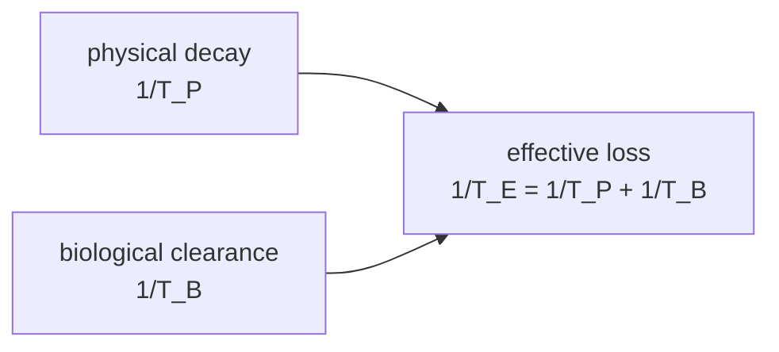

# Effective Half-Life

## Core Idea

When a radioactive tracer is inside a patient, the activity at the imaged site falls faster than physics alone predicts because the body also clears the tracer biologically. The **effective half-life** combines both losses.

## Symbol

- $T_E$ (effective), $T_P$ (physical), $T_B$ (biological)

## SI Unit

- second (s); usually quoted in hours or days for tracers

## Scalar or Vector

- scalar

## Definition

The **effective half-life** $T_E$ is the time for the amount of tracer present at a target site to fall to half its initial value when both radioactive decay and biological excretion act together. The three half-lives combine as

$$ \frac{1}{T_E} = \frac{1}{T_P} + \frac{1}{T_B} $$

- $T_P$ — **physical half-life**: time for half the nuclei to decay (set by the nuclide; see [[Half-Life]])
- $T_B$ — **biological half-life**: time for the body to excrete or metabolise half the chemical carrier (set by the labelled molecule and the organ)
- $T_E$ — what is actually observed by a gamma camera or PET scanner

Because the reciprocals add, $T_E$ is always *shorter* than either $T_P$ or $T_B$ — whichever clearance route is faster dominates.

## Related Equations

- $\lambda_E = \lambda_P + \lambda_B$ with $\lambda = \ln 2 / T$
- $N(t) = N_0 e^{-\lambda_E t}$ at the target site

## How It Is Measured

Sequential gamma-camera images of a labelled organ track count rate vs time. Fitting an exponential gives $\lambda_E$, hence $T_E$. The physical $T_P$ is known from tables, so $T_B = T_P T_E / (T_P - T_E)$ can be back-calculated.

## Graphical Meaning

On a log-linear plot of activity vs time, the slope is $-\lambda_E$. The effective curve sits *below* both the pure physical and pure biological decay lines.

## Foundation Links

- [[Half-Life]]
- [[Radioactive-Decay]]
- [[Activity]]

## Related Concepts

- [[Decay-Constant]]
- [[Isotopes]]

## Related Laws or Results

- [[Exponential-Decay-Law]]

## Related Experiments

- Activity-vs-time measurements after tracer injection

## Frontier Links

- [[Particle-Physics-Map]] — connection to positron emission tomography

## Common Mistakes

- Adding the half-lives directly ($T_E \neq T_P + T_B$) — it is the *reciprocals* that add
- Forgetting that biological clearance varies with organ and patient
- Assuming a long $T_P$ always means a long dose duration — fast biological clearance can shorten $T_E$ dramatically
- Confusing $T_E$ with the imaging time window (which is also limited by sensitivity and decay)

## Why It Matters for Dose

Patient radiation dose scales with $T_E$, not $T_P$. Choosing technetium-99m ($T_P \approx 6$ h) labelled to a rapidly excreted carrier ($T_B$ a few hours) gives a low effective dose while still providing enough photons for a diagnostic image.

## Visuals

*Source: Authored for this vault (CC0). No external copyright.*

## Source Trace

- Source: [[AQA-Physics-7407-7408-Specification]] §3.10.6
- Public reference: HyperPhysics — Biological half-life; OpenStax College Physics §32
