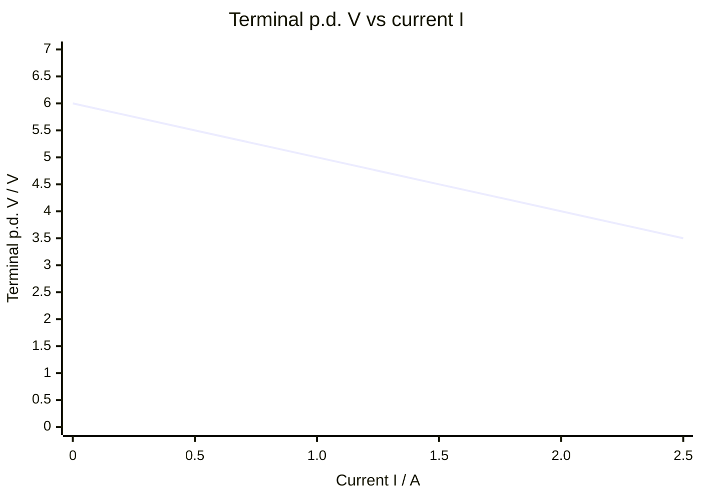

# Electromotive Force

## Core Idea

Electromotive force (e.m.f.) is the energy a source gives to each unit of charge as it drives that charge around a circuit. Despite the name it is not a force — it is energy per unit charge.

## Symbol

- $\varepsilon$ (sometimes $E$)

## SI Unit

- Volt, $\text{V}$ (equivalently $\text{J C}^{-1}$).

## Scalar or Vector

- Scalar.

## Definition

The e.m.f. of a source is the total electrical energy transferred per unit charge passing through it:

$$\varepsilon = \frac{W}{Q}$$

where $W$ is the energy supplied (J) and $Q$ is the [[Charge]] (C). It contrasts with [[Potential-Difference]], which is energy *transferred from* the circuit per unit charge in an external component.

## Related Equations

- Terminal p.d. with internal resistance $r$ and load current $I$: $V = \varepsilon - Ir$
- Energy form: $\varepsilon = I(R + r)$
- Maximum power transfer occurs when external resistance $R = r$.

## How It Is Measured

A high-resistance voltmeter across the terminals of a cell with no current flowing reads the e.m.f. (the lost-volts term $Ir$ is then zero). Under load, the terminal p.d. is less than $\varepsilon$. Plotting terminal p.d. against current and extrapolating to zero current gives $\varepsilon$ as the intercept.

## Graphical Meaning

On a graph of terminal p.d. $V$ (y-axis) against current $I$ (x-axis), the $y$-intercept is $\varepsilon$ and the gradient is $-r$ (the internal resistance).

## Foundation Links

- [[Current]]
- [[Potential-Difference]]

## Related Concepts

- [[Mean-Drift-Velocity]]

## Related Laws or Results

- [[Snell-Law]]

## Related Experiments

- [[Measuring-the-Planck-Constant]]

## Frontier Links

- Electrochemical and photovoltaic sources of e.m.f. connect to materials and energy research; beyond A-Level depth.

## Common Mistakes

- Treating e.m.f. as a force (it has units of volts, not newtons).
- Confusing e.m.f. with terminal potential difference when current flows.
- Forgetting the lost volts $Ir$ inside the source.

## Visuals

### Terminal p.d. vs Current: y-intercept = e.m.f., Gradient = −r

*Figure: The y-intercept (I = 0) gives the e.m.f. ε = 6 V; the gradient equals −r = −1 Ω (internal resistance). At higher currents the "lost volts" Ir increases and the terminal p.d. falls. Extrapolating to V = 0 gives the short-circuit current.*
*Source: Authored for this vault (CC0). No external copyright.*

## Source Trace

- Source: OpenStax College Physics; HyperPhysics; IOPSpark
- OCR alignment: [[OCR-Physics-A-H556-Specification]]
