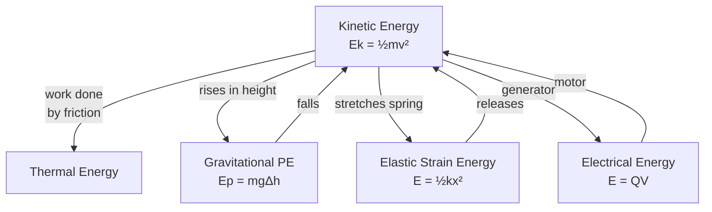

# Energy

## Core Idea

Energy is the capacity to do work. It cannot be created or destroyed, only transferred between stores (kinetic, gravitational, elastic, thermal, electrical, nuclear...) or carried by working, heating or radiation. Tracking energy is one of the most reliable problem-solving strategies in physics.

> This is the A-Level **physical-quantity** page. For the prerequisite idea, see the GCSE-layer foundation page under Foundation Links.

## Symbol

`E` (with subscripts: `E_k`, `E_p`)

## SI Unit

`J` (joule)

## Scalar or Vector

Scalar. Magnitude only; energy stores have no direction.

## Definition

Energy is a conserved scalar quantity that measures the ability of a system to do work. The total energy of an isolated system is constant.

## Related Equations

- Kinetic energy: $E_k = \frac{1}{2}mv^2$ — `m` = mass (kg), `v` = speed (m s⁻¹).
- Gravitational PE (near surface): $E_p = mg\Delta h$ — `g` = 9.81 N kg⁻¹, `Δh` = height change (m).
- Elastic strain energy: $E = \frac{1}{2}Fx = \frac{1}{2}kx^2$ — `F` = force (N), `x` = extension (m), `k` = spring constant (N m⁻¹). See [[Hookes-Law]].
- Work–energy: $W = \Delta E$. See [[Work]].
- Electrical: $E = QV$ — `Q` = charge (C), `V` = potential difference (V).

## How It Is Measured

Energy is inferred from measurable quantities (mass, speed, height, force, charge, p.d.) using the equations above, or from calorimetry (thermal energy) and electrical power × time.

## Graphical Meaning

Area under a force–displacement graph = energy transferred (work). On a [[Force-Extension-Graph]], the area under the linear region = elastic strain energy stored.

## Foundation Links

- [[Energy-GCSE|Energy]] (GCSE-Foundations layer — prerequisite idea)

## Related Concepts

- [[Work]]
- [[Power]]
- [[Mass]]
- [[Velocity]]

## Related Laws or Results

- [[Newton-Second-Law]]
- [[Hookes-Law]]

## Related Experiments

- Energy transfer in a falling/oscillating mass; calorimetry

## Frontier Links

- [[Relativity-Map]] (mass–energy equivalence)
- [[Particle-Physics-Map]] (energy in particle interactions)

## Common Mistakes

- Saying energy is "used up" rather than transferred or dissipated
- Forgetting the ½ in kinetic and elastic energy formulae
- Confusing energy with power or with force

## Visuals

### Energy Store and Transfer Relationships

*Figure: Energy cannot be created or destroyed — only transferred between stores. The arrows show typical conversion routes. At each transfer the total energy is conserved, though thermal dissipation is often unavoidable.*
*Source: Authored for this vault (CC0). No external copyright.*

### From Wikipedia

<!-- wiki-images: yes -->

#### Plasma globe 60th

![[_attachments/03_Physical-Quantities/Energy-Quantity--wiki-plasma-globe-60th.jpg]]
*Figure: from Wikipedia article "Energy".*
*Source: Wikimedia Commons — [Plasma_globe_60th.jpg](https://commons.wikimedia.org/wiki/File:Plasma_globe_60th.jpg). Retrieved 2026-05-20.*

#### Carnot heat engine 2

![[_attachments/03_Physical-Quantities/Energy-Quantity--wiki-carnot-heat-engine-2.svg]]
*Figure: from Wikipedia article "Energy".*
*Source: Wikimedia Commons — [Carnot heat engine 2.svg](https://commons.wikimedia.org/wiki/File:Carnot_heat_engine_2.svg). Retrieved 2026-05-20.*

#### Energy and life

![[_attachments/03_Physical-Quantities/Energy-Quantity--wiki-energy-and-life.svg]]
*Figure: from Wikipedia article "Energy".*
*Source: Wikimedia Commons — [Energy and life.svg](https://commons.wikimedia.org/wiki/File:Energy_and_life.svg). Retrieved 2026-05-20.*

## Source Trace

- Source: OpenStax College Physics; The Physics Classroom; HyperPhysics (paraphrased, no copied text)
- OCR alignment: [[OCR-Physics-A-H556-Specification]]
  - Energy
