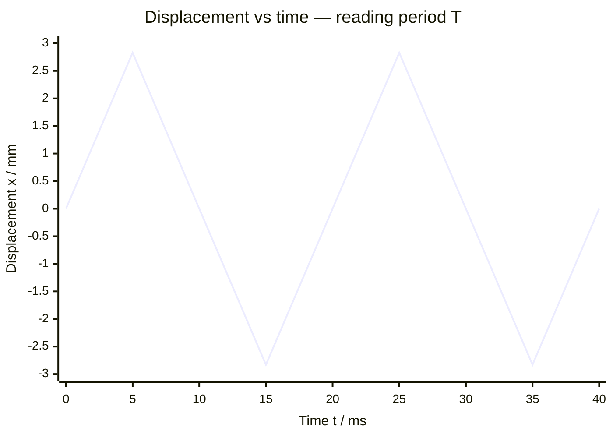

# Frequency

## Core Idea

Frequency tells you how many complete cycles of a repeating event happen each second — how many wave crests pass a point, or how many full oscillations a pendulum makes, per second. High-frequency sound is high-pitched; high-frequency light is more energetic.

## Symbol

`f` (sometimes `ν`)

## SI Unit

`Hz` (hertz). `1 Hz = 1 s⁻¹` (one cycle per second).

## Scalar or Vector

Scalar. Magnitude only; always positive.

## Definition

Frequency is the number of complete cycles (or oscillations, or waves) per unit time.

## Related Equations

- $f = 1 / T$ — `f` = frequency (Hz), `T` = period (s).
- Wave equation: $v = f\lambda$ — `v` = wave speed (m s⁻¹), `λ` = wavelength (m).
- Photon energy: $E = hf$ — `h` = Planck constant (J s), `E` in joules.
- Angular frequency: $\omega = 2\pi f$ (rad s⁻¹).

## How It Is Measured

Count cycles over a measured time and divide (e.g. time 20 oscillations and divide by 20 then invert), use a frequency meter, or read the period from an oscilloscope/data-logger trace and invert it. Timing many cycles reduces percentage uncertainty.

## Graphical Meaning

On a displacement–time graph of an oscillation, the frequency is the reciprocal of the time for one full cycle (the period). On a frequency spectrum, peaks mark the frequencies present.

## Foundation Links

- [[Energy-Quantity|Energy]] (GCSE-Foundations layer — photon energy link)

## Related Concepts

- [[Period]]
- [[Wavelength]]
- [[Amplitude]]
- [[Intensity]]

## Related Laws or Results

- None named (links to the wave equation and photoelectric effect)

## Related Experiments

- Measuring the frequency of a sound wave with an oscilloscope

## Frontier Links

- [[Quantum-Mechanics-Map]] (photon energy and the photoelectric effect)

## Common Mistakes

- Confusing frequency with period (they are reciprocals)
- Mixing up frequency and angular frequency ($\omega = 2\pi f$)
- Timing only one cycle (large percentage uncertainty)

## Visuals

### Period and Frequency on a Displacement–Time Graph

*Figure: One complete cycle takes T = 20 ms (from 0 to 20 ms). Frequency f = 1/T = 1/0.020 = 50 Hz. Timing multiple cycles and averaging reduces timing uncertainty: f = N cycles / total time.*
*Source: Authored for this vault (CC0). No external copyright.*

### From Wikipedia

<!-- wiki-images: yes -->

#### ลูกตุ้มธรรมชาติ

![[_attachments/03_Physical-Quantities/Frequency--wiki-img.gif]]
*Figure: from Wikipedia article "Frequency".*
*Source: Wikimedia Commons — [ลูกตุ้มธรรมชาติ.gif](https://commons.wikimedia.org/wiki/File:ลูกตุ้มธรรมชาติ.gif). Retrieved 2026-05-20.*

#### Czestosciomierz-49.9Hz

![[_attachments/03_Physical-Quantities/Frequency--wiki-czestosciomierz-499hz.jpg]]
*Figure: from Wikipedia article "Frequency".*
*Source: Wikimedia Commons — [Czestosciomierz-49.9Hz.jpg](https://commons.wikimedia.org/wiki/File:Czestosciomierz-49.9Hz.jpg). Retrieved 2026-05-20.*

#### EM spectrum

![[_attachments/03_Physical-Quantities/Frequency--wiki-em-spectrum.svg]]
*Figure: from Wikipedia article "Frequency".*
*Source: Wikimedia Commons — [EM spectrum.svg](https://commons.wikimedia.org/wiki/File:EM_spectrum.svg). Retrieved 2026-05-20.*

## Source Trace

- Source: OpenStax College Physics; The Physics Classroom; HyperPhysics (paraphrased, no copied text)
- OCR alignment: [[OCR-Physics-A-H556-Specification]]
