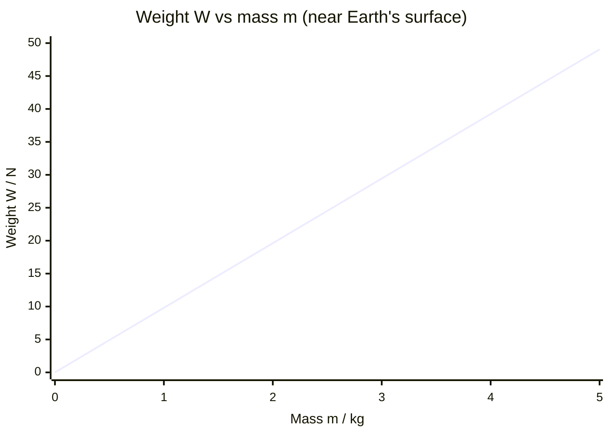

# Gravitational Field Strength

## Core Idea

Gravitational field strength tells you how strong gravity is at a place — the force gravity exerts on each kilogram of mass. Near Earth's surface it is about 9.81 N kg⁻¹, which is also the acceleration of an object in free fall. It is weaker on the Moon and decreases with height above a planet.

## Symbol

`g`

## SI Unit

`N kg⁻¹` (numerically equal to `m s⁻²`)

## Scalar or Vector

Vector. It points toward the centre of the mass producing the field (downward near Earth's surface).

## Definition

Gravitational field strength at a point is the gravitational force exerted per unit mass on a small test mass placed at that point.

## Related Equations

- $g = F / m$ — `g` = field strength (N kg⁻¹), `F` = gravitational force (N), `m` = mass (kg).
- $W = mg$ — `W` = weight (N). See [[Weight]].
- Radial field of a planet: $g = GM/r^2$ — `G` = gravitational constant, `M` = planet mass (kg), `r` = distance from centre (m). See [[Newtons-Law-of-Gravitation]].
- In free fall the acceleration equals `g`.

## How It Is Measured

From weight–mass data (newtonmeter, gradient of `W` vs `m`), or from a free-fall experiment: measure the time for an object to fall a known distance (light gates / electromagnet-and-trapdoor) and use $s = \frac{1}{2}gt^2$.

## Graphical Meaning

A graph of weight against mass at one location is a straight line through the origin with gradient `g`. For a radial field, `g` against $1/r^2$ is a straight line through the origin.

## Foundation Links

- [[From-Weight-to-Gravitational-Field-Strength]]

## Related Concepts

- [[Weight]]
- [[Mass]]
- [[Electric-Field-Strength]] (close analogy)
- [[Acceleration]]

## Related Laws or Results

- [[Newtons-Law-of-Gravitation]]
- [[Newton-Second-Law]]

## Related Experiments

- Measuring g by free fall (electromagnet and timer)

## Frontier Links

- [[Relativity-Map]] (general relativity reinterprets gravity — orientation only)

## Common Mistakes

- Confusing field strength `g` with the gravitational constant `G`
- Treating `g` as a universal constant (it varies with location)
- Forgetting `g` is a vector

## Visuals

### Weight vs Mass: Gradient = g

*Figure: W = mg gives a straight line through the origin; the gradient is g ≈ 9.81 N kg⁻¹. This same gradient can be measured in a free-fall experiment. On the Moon or another planet the gradient changes because g is different there.*
*Source: Authored for this vault (CC0). No external copyright.*

## Source Trace

- Source: OpenStax College Physics; The Physics Classroom; HyperPhysics (paraphrased, no copied text)
- OCR alignment: [[OCR-Physics-A-H556-Specification]]
