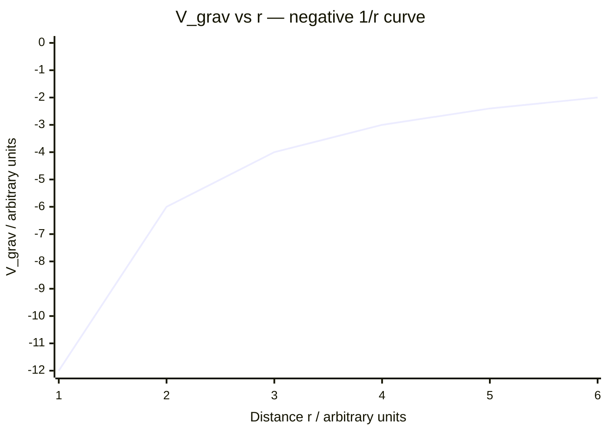

# Gravitational Potential

## Core Idea

Gravitational potential at a point is the gravitational potential energy per
unit mass placed at that point — a property of the field alone, independent
of the test mass.

## Symbol

- V_grav (or V_g)

## SI Unit

- joule per kilogram, J kg⁻¹

## Scalar or Vector

- Scalar (no direction; potentials from several masses add algebraically)

## Definition

Gravitational potential at a point is the work done per unit mass to bring a
small test mass from infinity to that point. The reference zero is at
infinity. For a point mass (or outside a uniform sphere):

V_grav = − G M / r

where G = 6.67 × 10⁻¹¹ N m² kg⁻², M = mass producing the field (kg),
r = distance from its centre (m). The value is always negative, approaching
zero only at infinite distance.

## Related Equations

- E_p = m × V_grav (links to [[Gravitational-Potential-Energy]])
- g = − ΔV_grav / Δr (field strength is the negative potential gradient)
- ΔV_grav = work per unit mass moved between two points

## How It Is Measured

Not measured directly. It is calculated from M and r, or inferred from
measured [[Gravitational-Field-Strength]] by integrating g over distance, or
from orbital/energy data of satellites.

## Graphical Meaning

A graph of V_grav against r rises from a large negative value towards zero as
r increases. Its gradient at any point gives −g, so the field strength is the
slope of the potential curve. Equipotential surfaces are spheres around the
mass; no work is done moving along one.

## Foundation Links

- [[Weight]]
- [[Mass]]

## Related Concepts

- [[Gravitational-Field]]
- [[Gravitational-Potential-Energy]]

## Related Laws or Results

- [[Newtons-Law-of-Gravitation]]
- [[Conservation-of-Energy]]

## Related Experiments

- Satellite energy and escape-velocity calculations

## Frontier Links

- [[Cosmology-Map]]

## Common Mistakes

- Confusing potential (J kg⁻¹) with potential energy (J)
- Dropping the minus sign in V = −GM/r
- Treating potential as a vector
- Forgetting the zero is at infinity, not the surface

## Visuals

### Gravitational Potential vs Distance (1/r Hyperbola)

*Figure: Gravitational potential V_grav = −GM/r is always negative and approaches zero only at infinity (r → ∞). The gradient at any point equals −g (field strength). The curve is a negative 1/r hyperbola; compare with electric potential, which uses the same form but can be positive or negative depending on charge sign.*
*Source: Authored for this vault (CC0). No external copyright.*

## Source Trace

- Source: OpenStax College Physics; HyperPhysics; NASA educational material — no copied text
- OCR alignment: [[OCR-Physics-A-H556-Specification]]
- Section/Page: OCR M5.4 Gravitational fields
