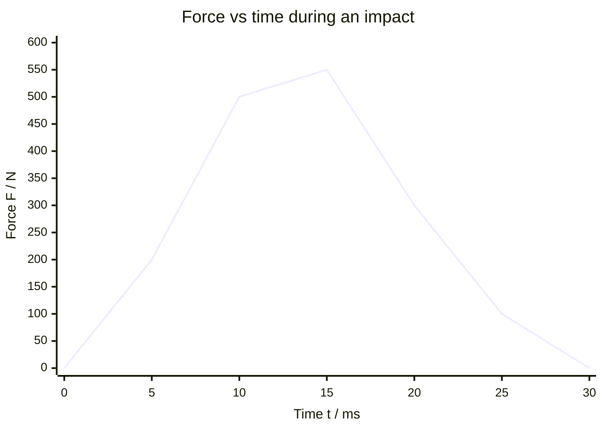

# Impulse

## Core Idea

Impulse is the "amount of push" delivered by a force acting over a time interval. The same change in momentum can be produced by a large force for a short time or a small force for a long time — which is exactly why crumple zones, airbags and bending knees on landing reduce injury (they extend the time, lowering the force).

## Symbol

`J` (sometimes `Δp`)

## SI Unit

`N s` (equivalently `kg m s⁻¹`)

## Scalar or Vector

Vector. It points in the direction of the (average) force and equals the change in momentum.

## Definition

Impulse is the product of a force and the time for which it acts; for a varying force it is the integral of force over time. It equals the change in momentum produced.

## Related Equations

- `J = FΔt` — `J` = impulse (N s), `F` = (average) resultant force (N), `Δt` = time interval (s).
- `J = Δp = mv − mu` — `m` = mass (kg), `u`, `v` = initial and final velocities (m s⁻¹).
- For a varying force, `J =` area under the force–time graph.

## How It Is Measured

A force sensor records force against time during an impact; the area under the curve gives the impulse. Alternatively, measure mass and the change in velocity (before/after via light gates or video) and use `J = Δp`.

## Graphical Meaning

On a **force–time graph**, impulse is the **area under the curve**. A tall, narrow region (large force, short time) can have the same area as a low, wide region (small force, long time) — equal impulse, equal momentum change.

## Foundation Links

- [[From-Speed-to-Velocity]]

## Related Concepts

- [[Momentum]]
- [[Force]]
- [[Mass]]
- [[Velocity]]

## Related Laws or Results

- [[Newton-Second-Law]]
- [[Conservation-of-Momentum]]

## Related Experiments

- Measuring impulse from a force sensor during impact

## Frontier Links

- None at A-Level depth

## Common Mistakes

- Treating impulse as a scalar and dropping direction
- Forgetting impulse equals change in momentum, not momentum itself
- Using peak force instead of average force in `J = FΔt`

## Visuals

### Force–Time Graph: Area = Impulse

*Figure: The area under the force–time curve equals the impulse J = Δp (change in momentum). A short, tall peak (hard collision) and a long, low hump (padded collision) can have the same area — the same impulse — but very different peak forces. Crumple zones and airbags extend the time to reduce peak force.*
*Source: Authored for this vault (CC0). No external copyright.*

## Source Trace

- Source: OpenStax College Physics; The Physics Classroom; HyperPhysics (paraphrased, no copied text)
- OCR alignment: [[OCR-Physics-A-H556-Specification]]
