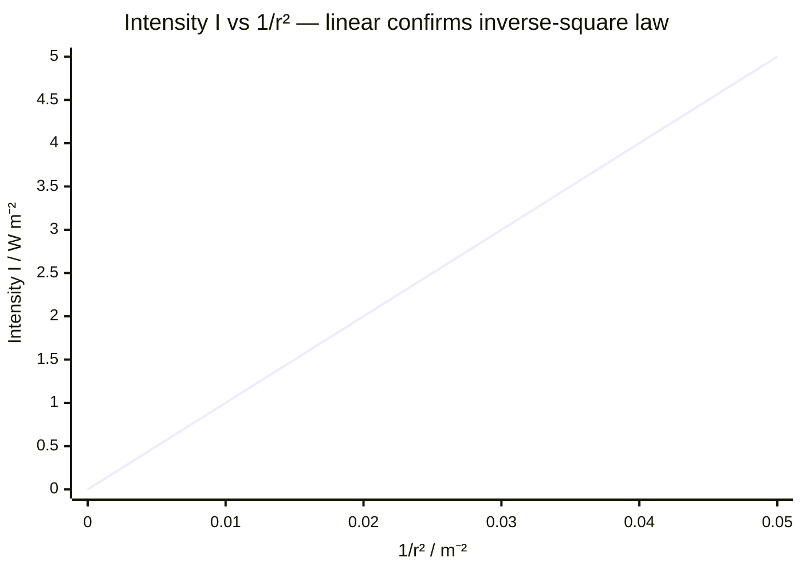

# Intensity

## Core Idea

Intensity measures how much wave power lands on each square metre of surface. It is why a light looks dimmer as you move away (the same power spreads over a larger area) and why standing closer to a speaker sounds louder. Intensity depends on the square of the wave's amplitude.

## Symbol

`I`

## SI Unit

`W m⁻²` (watts per square metre)

## Scalar or Vector

Scalar. Magnitude only; positive.

## Definition

Intensity is the radiant power transmitted per unit area perpendicular to the direction of wave propagation.

## Related Equations

- $I = P / A$ — `I` = intensity (W m⁻²), `P` = power (W), `A` = area (m²).
- Point source (inverse-square law): $I = P / (4\pi r^2)$ — `r` = distance from source (m).
- Amplitude relation: $I \propto A^2$ (intensity is proportional to amplitude squared).

## How It Is Measured

Measure the power received by a detector of known area (e.g. a light sensor or solar cell) and divide by that area. Varying the distance from a point source and plotting intensity tests the inverse-square law.

## Graphical Meaning

For a point source, a graph of intensity against $1/r^2$ is a straight line through the origin (gradient $= P/4\pi$), confirming the inverse-square law. A graph of amplitude against $\sqrt{I}$ is linear.

## Foundation Links

- [[Power]] (GCSE-Foundations layer — power spread over area)

## Related Concepts

- [[Amplitude]]
- [[Power]]
- [[Frequency]]
- [[Wavelength]]

## Related Laws or Results

- None named (inverse-square behaviour for point sources)

## Related Experiments

- Testing the inverse-square law for light or gamma radiation

## Frontier Links

- [[Cosmology-Map]] (luminosity and standard candles — orientation only)

## Common Mistakes

- Forgetting intensity depends on amplitude **squared** (doubling amplitude quadruples intensity)
- Using a linear (instead of inverse-square) fall-off with distance
- Confusing intensity (W m⁻²) with power (W)

## Visuals

### Intensity vs 1/r²: Inverse-Square Law

*Figure: Plotting I against 1/r² gives a straight line through the origin, confirming I = P/(4πr²) — the inverse-square law. The gradient equals P/4π. Plotting I against r would give a hyperbola; plotting I against 1/r² linearises the data for easier gradient measurement.*
*Source: Authored for this vault (CC0). No external copyright.*

## Source Trace

- Source: OpenStax College Physics; The Physics Classroom; HyperPhysics (paraphrased, no copied text)
- OCR alignment: [[OCR-Physics-A-H556-Specification]]
