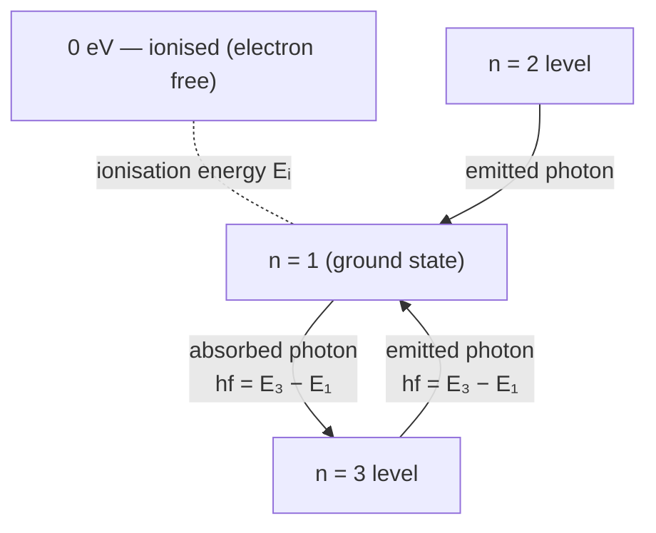

# Ionisation Energy

## Core Idea

Ionisation energy is the minimum energy needed to completely remove the most loosely bound electron from a neutral atom in its ground state, leaving a positive ion.

## Symbol

- `E_i` (no single fixed symbol; often quoted as a value in eV)

## SI Unit

- joule, `J`. Atomic-scale values are usually quoted in **electronvolts (eV)**, where `1 eV = 1.60 × 10⁻¹⁹ J`.

## Scalar or Vector

- Scalar (an amount of energy).

## Definition

The energy required to take the outermost ground-state electron from its bound [[Energy-Levels|energy level]] (a negative energy) up to the zero (just-free) level. Numerically it equals the depth of that level below zero: if the ground state is at `−13.6 eV` (hydrogen), the ionisation energy is `13.6 eV`.

It is the limiting case of [[Ionisation]]: supply exactly `E_i` and the electron is freed with no kinetic energy; supply more and the excess becomes the electron's kinetic energy.

## Related Equations

- Photo-ionisation threshold: $h f_{min} = E_i$ (a [[Photon-Energy|photon]] just able to ionise) — parallels the [[Photoelectric-Equation]].
- From energy levels: $E_i = 0 - E_{ground} = -E_{ground}$.
- Unit conversion: $E_i(\text{J}) = E_i(\text{eV}) \times 1.60 \times 10^{-19}$.

## How It Is Measured

- **Spectroscopically:** find the series limit (convergence frequency) of an emission/absorption series; $E_i = h f_{limit}$.
- **By electron collision:** increase accelerating voltage until ionisation current suddenly rises (the ionisation potential in volts equals `E_i` in eV).

## Graphical Meaning

On an energy-level diagram it is the vertical gap from the ground state up to the `0 eV` line. On a spectral-series plot the line spacing converges to the limit; the limiting frequency multiplied by `h` gives the ionisation energy.

## Foundation Links

- [[Atomic-Structure]]
- [[Charge]]

## Related Concepts

- [[Ionisation]]
- [[Energy-Levels]]
- [[Photoelectric-Effect]]

## Related Laws or Results

- [[Photoelectric-Equation]]
- [[Conservation-of-Energy]]

## Related Experiments

- Determining the ionisation energy of hydrogen from its emission-spectrum series limit.

## Frontier Links

- Successive ionisation energies and the periodic trends they reveal connect to atomic and [[Particle-Physics-Map|particle-scale]] structure.

## Common Mistakes

- Confusing ionisation energy (electron fully removed) with excitation energy (electron raised but still bound).
- Forgetting it refers to the ground-state, most weakly bound electron.
- Dropping the eV → J conversion in numerical work.

## Visuals

### Energy Level Diagram: Ionisation Energy as the Gap to Zero

*Figure: The ionisation energy Eᵢ is the gap from the ground state (n = 1) up to the 0 eV line. Absorbed photons can excite the electron to higher levels (n = 2, 3…); a photon of exactly Eᵢ removes the electron entirely. Excess energy above Eᵢ becomes the freed electron's kinetic energy.*
*Source: Authored for this vault (CC0). No external copyright.*

## Source Trace

- Source: OpenStax College Physics; HyperPhysics; Physics LibreTexts — paraphrased, no copied text.
- OCR alignment: [[OCR-Physics-A-H556-Specification]]
