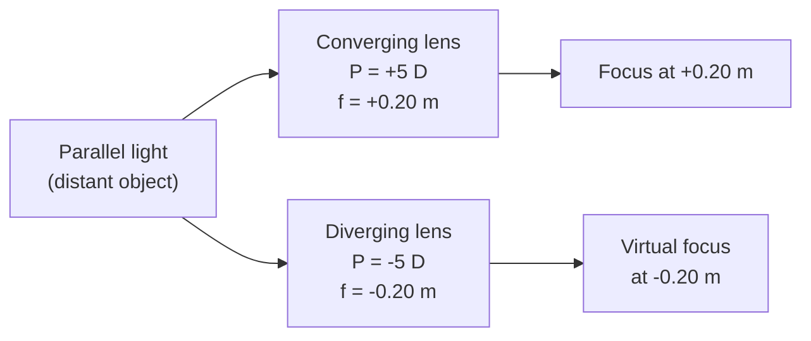

# Lens Power

## Core Idea

Lens power measures how strongly a lens bends parallel light to a focus. A short focal length means strong bending and large power; a long focal length means weak bending and small power.

## Symbol

- $P$

## SI Unit

- dioptre, $\text{D} = \text{m}^{-1}$ (one dioptre is the power of a lens of focal length one metre)

## Scalar or Vector

- Scalar (with a sign that records lens type)

## Definition

The power of a thin lens is the reciprocal of its focal length, where the focal length is measured in metres:

$$P = \frac{1}{f}$$

- $f > 0$ for a converging lens, so $P > 0$.
- $f < 0$ for a diverging lens, so $P < 0$.

The sign matters: an optician's prescription of $+2.00\,\text{D}$ is a converging correction; $-2.00\,\text{D}$ is a diverging one.

## Related Equations

- For thin lenses in contact, powers add:

$$P_\text{total} = P_1 + P_2 + \dots$$

This is why a "+1.5 D" reading lens placed in front of a "-3.0 D" myopic correction acts like a single "-1.5 D" lens.

- Power links to the [[Lens-Equation]] via $1/f$, so $1/u + 1/v = P$.

## How It Is Measured

- Place a distant lamp on one side of the lens and slide a screen on the other until the image is sharpest. The lens-to-screen distance is $f$ (in metres); take the reciprocal.
- Opticians use a *focimeter* (lensmeter) which reads $P$ directly in dioptres for both spherical and cylindrical components.

## Graphical Meaning

A plot of $P$ vs $1/f$ is a straight line through the origin with gradient 1 D m. A plot of image distance vs object distance at fixed $P$ has the [[Lens-Equation]] as its constraint.

## Foundation Links

- [[Ray-Model-of-Light]]
- [[Refractive-Index]]

## Related Concepts

- [[Physics-of-the-Eye]]
- [[Defects-of-Vision]]

## Related Laws or Results

- [[Lens-Equation]]
- [[Snell-Law]]

## Related Experiments

- Focal length by distant-object method
- Focal length by no-parallax method

## Frontier Links

- Variable-focus liquid lenses; intra-ocular implants

## Common Mistakes

- Using $f$ in centimetres — the dioptre is defined for $f$ in metres only.
- Dropping the sign and so confusing converging and diverging corrections.
- Treating powers as multiplying rather than adding for thin lenses in contact.

## Visuals

### Converging vs diverging power

*Figure: equal-magnitude powers of opposite sign produce real and virtual foci at the same distance from the lens.*
*Source: Authored for this vault (CC0). No external copyright.*

### From Wikimedia

<!-- wiki-images: yes -->

#### Converging and diverging lens shapes
![[_attachments/03_Physical-Quantities/Lens-Power--wiki-lens-types.svg]]
*Figure: convex (converging, positive power) and concave (diverging, negative power) lens profiles — the shape that sets the sign and magnitude of $P = 1/f$.*
*Source: Wikimedia Commons — [Lenses en.svg](https://commons.wikimedia.org/wiki/File:Lenses_en.svg) — CC BY-SA 3.0 — ElfQrin. Retrieved 2026-06-27.*

## Source Trace

- Source: [[AQA-Physics-7407-7408-Specification]] §3.10.1
- Public source: HyperPhysics (Power of a Lens); OpenStax College Physics — Vision Correction
- Section/Page: Optional unit 3.10 — Medical physics — physics of vision
