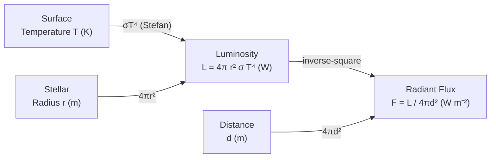

# Luminosity

## Core Idea

Luminosity is the total power radiated by a star in all directions — its true
brightness, independent of how far away it is.

## Symbol

- L

## SI Unit

- watt, W (J s⁻¹)

## Scalar or Vector

- Scalar

## Definition

Luminosity is the total electromagnetic power emitted by a star across all
wavelengths. It differs from the *observed* brightness (radiant flux
intensity) reaching Earth, which also depends on distance.

## Related Equations

- $L = 4\pi r^2 \sigma T^4$ (Stefan's law for a spherical black body — see
  [[Stefans-Law]]), with r = stellar radius (m), σ = Stefan constant
  5.67 × 10⁻⁸ W m⁻² K⁻⁴, T = surface temperature (K)
- $F = L / (4\pi d^2)$ — observed [[Intensity]] (radiant flux, W m⁻²) at distance
  d, assuming radiation spreads over a sphere of area $4\pi d^2$
- Combined with [[Wiens-Displacement-Law]] ($\lambda_{max} T = 2.90 \times 10^{-3}\,\text{m K}$) to
  find T from a star's spectrum

## How It Is Measured

Measure the radiant flux F reaching Earth with a calibrated detector, then
determine distance d (parallax — see [[Astronomical-Distances]] — or standard
candles) and compute $L = 4\pi d^2 F$.

## Graphical Meaning

Luminosity is the vertical axis of the [[Hertzsprung-Russell-Diagram]]
(usually logarithmic). On a log L against log T plot the main sequence forms
a diagonal band; equal-radius stars lie on straight lines because
$L \propto r^2 T^4$.

## Foundation Links

- [[Conservation-of-Energy]]

## Related Concepts

- [[Stellar-Evolution]]
- [[Astronomical-Distances]]

## Related Laws or Results

- [[Stefans-Law]]
- [[Wiens-Displacement-Law]]

## Related Experiments

- Flux measurement plus distance to derive stellar luminosity

## Frontier Links

- [[Cosmology-Map]]

## Common Mistakes

- Confusing luminosity (intrinsic power, W) with observed brightness/intensity
  (W m⁻², distance-dependent)
- Forgetting the 4πd² inverse-square spreading factor
- Using temperature in °C instead of kelvin in $L = 4\pi r^2\sigma T^4$

## Visuals

*Source: Authored for this vault (CC0). No external copyright.*

### From Wikipedia

<!-- wiki-images: yes -->

#### The Sun in white light

![[_attachments/03_Physical-Quantities/Luminosity--wiki-the-sun-in-white-light.jpg]]
*Figure: from Wikipedia article "Luminosity".*
*Source: Wikimedia Commons — [The_Sun_in_white_light.jpg](https://commons.wikimedia.org/wiki/File:The_Sun_in_white_light.jpg). Retrieved 2026-05-20.*

#### Crab Nebula

![[_attachments/03_Physical-Quantities/Luminosity--wiki-crab-nebula.jpg]]
*Figure: from Wikipedia article "Luminosity".*
*Source: Wikimedia Commons — [Crab Nebula.jpg](https://commons.wikimedia.org/wiki/File:Crab_Nebula.jpg). Retrieved 2026-05-20.*

#### Earth-moon

![[_attachments/03_Physical-Quantities/Luminosity--wiki-earth-moon.jpg]]
*Figure: from Wikipedia article "Luminosity".*
*Source: Wikimedia Commons — [Earth-moon.jpg](https://commons.wikimedia.org/wiki/File:Earth-moon.jpg). Retrieved 2026-05-20.*

## Source Trace

- Source: OpenStax College Physics; HyperPhysics; NASA educational material — no copied text
- OCR alignment: [[OCR-Physics-A-H556-Specification]]
- Section/Page: OCR M5.5 Astrophysics and cosmology
