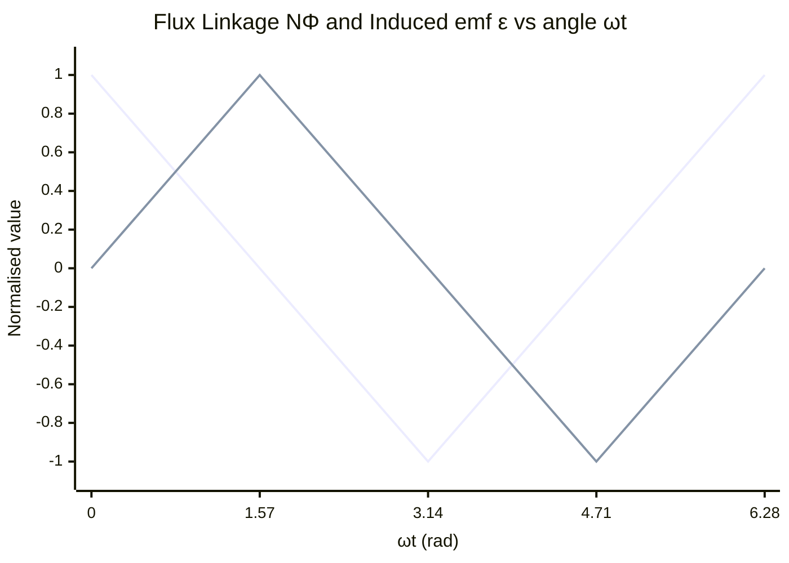

# Magnetic Flux Linkage

## Core Idea

Magnetic flux linkage is the total magnetic flux passing through a coil multiplied by the number of turns in that coil — it counts the flux "linked" with every loop.

## Symbol

- NΦ (number of turns N multiplied by flux Φ)

## SI Unit

- weber-turns (Wb), dimensionally the same as the weber

## Scalar or Vector

- Scalar (signed relative to a chosen positive sense around the coil)

## Definition

For a coil of N turns, each enclosing the same flux $\Phi = B A \cos\theta$, the flux linkage is:

$$N\Phi = B A N \cos\theta$$

where B is the [[Magnetic-Flux-Density]], A the area of one turn, N the number of turns, and θ the angle between the field and the normal to the coil.

## Related Equations

- $N\Phi = B A N \cos\theta$
- $\Phi = B A \cos\theta$ (single-loop flux, see [[Magnetic-Flux]])
- Induced e.m.f. $\varepsilon = -\frac{d(N\Phi)}{dt}$ (see [[Faradays-Law]])
- For a coil rotating at angular speed ω: $N\Phi = B A N \cos(\omega t)$, so $\varepsilon = B A N \omega \sin(\omega t)$

## How It Is Measured

Flux linkage is computed, not measured directly: determine B (Hall probe or search coil), measure coil area A, count turns N, and record orientation θ. Its rate of change is observed as an induced e.m.f. in the coil, captured by a data logger or oscilloscope.

## Graphical Meaning

A graph of flux linkage against time has a gradient equal to the negative of the induced e.m.f. For a uniformly rotating coil the linkage is sinusoidal; the induced e.m.f. is largest where the flux-linkage curve is steepest (passing through zero) and zero at the linkage peaks.

## Foundation Links

- [[Current]]
- [[Force]]

## Related Concepts

- [[Magnetic-Field]]
- [[Electromagnetic-Induction]]

## Related Laws or Results

- [[Faradays-Law]]
- [[Lenzs-Law]]

## Related Experiments

- [[Investigating-Electromagnetic-Induction]]

## Frontier Links

- Flux linkage underlies inductance and the design of inductors used in radio-frequency and power electronics.

## Common Mistakes

- Forgetting the factor N — using Φ when NΦ is required (and vice versa).
- Omitting cos θ for a coil not perpendicular to the field.
- Treating weber-turns as a different unit from the weber in calculations.

## Visuals

*Figure: NΦ (blue) varies as cos(ωt); the induced emf ε = −d(NΦ)/dt (orange) is 90° ahead — peaking where NΦ passes through zero.*
*Source: Authored for this vault (CC0). No external copyright.*

## Source Trace

OpenStax College Physics; HyperPhysics; Physics LibreTexts — no copied text.

OCR alignment: [[OCR-Physics-A-H556-Specification]]

- Source: public physics reference pool
- Section/Page: OCR M6.3 Electromagnetism
