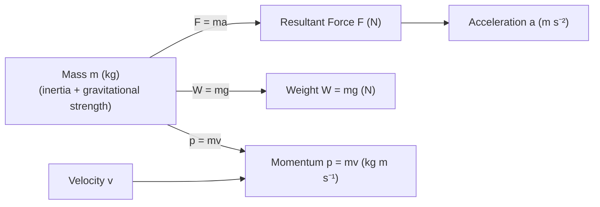

# Mass

## Core Idea

Mass measures the amount of matter in an object and its resistance to a change in motion (inertia). Unlike weight, mass does not change if the object is moved to the Moon or into deep space.

## Symbol

`m`

## SI Unit

`kg` (kilogram) — a base SI unit.

## Scalar or Vector

Scalar. Magnitude only; always positive.

## Definition

Mass is the property of a body that quantifies its inertia (the `m` in $F = ma$) and the strength of its gravitational interaction. Inertial and gravitational mass are experimentally equal.

## Related Equations

- $F = ma$ — `F` = resultant force (N), `a` = acceleration (m s⁻²). See [[Newton-Second-Law]].
- $W = mg$ — `W` = weight (N), `g` = gravitational field strength (N kg⁻¹). See [[Weight]].
- $\rho = m / V$ — `ρ` = density (kg m⁻³), `V` = volume (m³). See [[Density]].
- $p = mv$ — momentum (kg m s⁻¹). See [[Momentum]].
- $E = mc^2$ (mass–energy equivalence, frontier orientation only).

## How It Is Measured

Comparison with standard masses on a balance (a beam balance compares masses directly and gives the same reading anywhere). Electronic balances measure weight and convert using local `g`. Inertial mass can be found from measured force and acceleration.

## Graphical Meaning

In a force–acceleration plot for a fixed body, the gradient equals the mass. In a `p`–`v` plot, the gradient is mass.

## Foundation Links

- [[From-Weight-to-Gravitational-Field-Strength]]

## Related Concepts

- [[Weight]]
- [[Force]]
- [[Density]]
- [[Momentum]]
- [[Energy-Quantity|Energy]]

## Related Laws or Results

- [[Newton-Second-Law]]
- [[Newtons-Law-of-Gravitation]]

## Related Experiments

- Determining inertial mass from F = ma data

## Frontier Links

- [[Particle-Physics-Map]] (origin of mass)
- [[Relativity-Map]] (mass–energy equivalence)

## Common Mistakes

- Confusing mass with weight
- Stating mass in newtons
- Believing mass changes with location

## Visuals

*Figure: Mass m links force, acceleration, weight, and momentum through Newton's second law.*
*Source: Authored for this vault (CC0). No external copyright.*

## Source Trace

- Source: OpenStax College Physics; The Physics Classroom; HyperPhysics (paraphrased, no copied text)
- OCR alignment: [[OCR-Physics-A-H556-Specification]]
