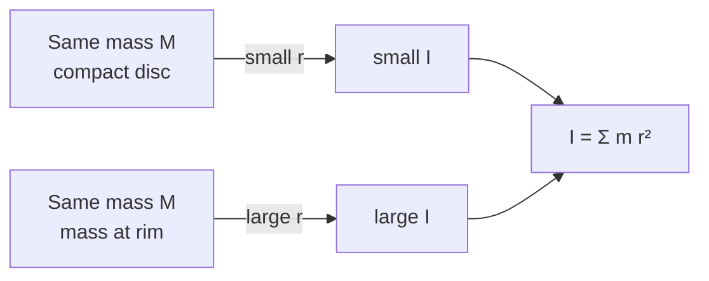

# Moment of Inertia

## Core Idea

Moment of inertia measures how hard it is to change the rotation of an object about a chosen axis. It is the rotational counterpart of [[Mass]]: where mass resists changes in linear velocity, moment of inertia resists changes in [[Angular-Velocity]].

## Symbol

- $I$

## SI Unit

- kilogram metre squared, $\mathrm{kg\,m^2}$

## Scalar or Vector

- Scalar (defined about a specific axis; the axis must always be stated).

## Definition

For a single point mass $m$ at perpendicular distance $r$ from the axis of rotation:

$$
I = m r^{2}
$$

For an extended body, sum (or integrate) over all mass elements:

$$
I = \sum_i m_i r_i^{2}
$$

- $m$, $m_i$: mass / mass element, in kg.
- $r$, $r_i$: perpendicular distance of that mass from the axis, in m.
- Axis: must be specified — the same body has different $I$ about different axes.

In AQA Engineering Physics, expressions for $I$ of standard shapes (uniform rod, disc, sphere, ring) are **given in the exam** — you are not expected to derive them.

## Related Equations

- Rotational kinetic energy: $E_k = \tfrac{1}{2}I\omega^{2}$ — see [[Rotational-Kinetic-Energy]].
- Newton's second law for rotation: $T = I\alpha$ — see [[Torque-and-Angular-Acceleration]].
- Angular momentum: $L = I\omega$ — see [[Angular-Momentum]].

## How It Is Measured

Typically inferred rather than measured directly. A common lab approach:

1. Apply a known torque $T$ (e.g. a hanging mass on a string wound round a pulley).
2. Measure the resulting angular acceleration $\alpha$ from an [[Angular-Velocity]]–time graph.
3. Use $T = I\alpha$ to extract $I$ — the gradient method on a $T$ vs $\alpha$ plot gives $I$ directly.

## Graphical Meaning

On a graph of torque against angular acceleration, gradient $= I$. On a graph of rotational KE against $\omega^{2}$, gradient $= \tfrac{1}{2}I$ (see [[Finding-Gradient-from-a-Graph]]).

## Foundation Links

- [[Mass]]
- [[Moment]]
- [[Circular-Motion]]

## Related Concepts

- [[Rotational-Kinetic-Energy]]
- [[Rotational-Motion]]
- [[Centre-of-Mass]]

## Related Laws or Results

- [[Torque-and-Angular-Acceleration]]
- [[Conservation-of-Angular-Momentum]]
- [[Newton-Second-Law]]

## Related Experiments

- [[...]]

## Frontier Links

- [[...]]

## Common Mistakes

- Quoting $I$ without stating the axis — the same body has many different values.
- Treating $I$ as a property of the object alone, like mass — it depends on **mass distribution about the axis**.
- Using diameter instead of radius, or measuring $r$ along the rod rather than perpendicular to the axis.
- Adding $I$ values for parts about *different* axes — only add about the **same** axis.

## Visuals

### Mass distribution sets I

*Figure: Two objects of equal mass can have very different moments of inertia depending on how that mass is distributed about the axis.*
*Source: Authored for this vault (CC0). No external copyright.*

## Source Trace

- Source: [[AQA-Physics-7407-7408-Specification]] §3.11.1 (Engineering Physics — Rotational dynamics)
- Section/Page: Public reference — HyperPhysics; OpenStax College Physics
