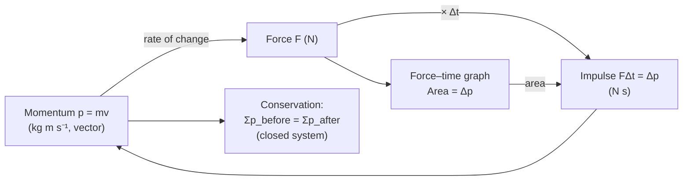

# Momentum

## Core Idea

Momentum measures "how hard it is to stop" a moving object — it combines how much mass is moving with how fast and in which direction. A slow lorry and a fast bullet can carry comparable momentum. Total momentum is conserved in collisions, which makes it one of the most powerful tools in mechanics.

## Symbol

`p`

## SI Unit

`kg m s⁻¹` (equivalently `N s`)

## Scalar or Vector

Vector. It points in the direction of the velocity. Conservation must be applied separately to each direction.

## Definition

Linear momentum is the product of an object's mass and its velocity. The resultant force on a body equals the rate of change of its momentum.

## Related Equations

- $p = mv$ — `p` = momentum (kg m s⁻¹), `m` = mass (kg), `v` = velocity (m s⁻¹).
- $F = \Delta p / \Delta t$ — `F` = resultant force (N), `Δt` = time (s). See [[Newton-Second-Law]].
- $\Sigma p_{before} = \Sigma p_{after}$ (closed system). See [[Conservation-of-Momentum]].
- Impulse–momentum: $F\Delta t = \Delta p$. See [[Impulse]].

## How It Is Measured

Indirectly: measure mass (balance) and velocity (light gates, motion sensor, video). In collision experiments, momentum before and after is computed from these measurements to test conservation.

## Graphical Meaning

On a force–time graph the **area under the curve** equals the change in momentum (impulse). A `p`–`v` graph for fixed mass is linear with gradient `m`.

## Foundation Links

- [[From-Speed-to-Velocity]]

## Related Concepts

- [[Mass]]
- [[Velocity]]
- [[Impulse]]
- [[Force]]

## Related Laws or Results

- [[Conservation-of-Momentum]]
- [[Newton-Second-Law]]

## Related Experiments

- Testing conservation of momentum with colliding trolleys

## Frontier Links

- [[Particle-Physics-Map]] (momentum in particle collisions)

## Common Mistakes

- Ignoring the vector nature (sign) of momentum
- Forgetting momentum is conserved only for a closed system
- Confusing momentum with kinetic energy (energy is not always conserved in collisions; momentum is)

## Visuals

*Figure: Momentum p links to force via Newton's second law; impulse FΔt equals the change in momentum; total momentum is conserved in a closed system.*
*Source: Authored for this vault (CC0). No external copyright.*

## Source Trace

- Source: OpenStax College Physics; The Physics Classroom; HyperPhysics (paraphrased, no copied text)
- OCR alignment: [[OCR-Physics-A-H556-Specification]]
