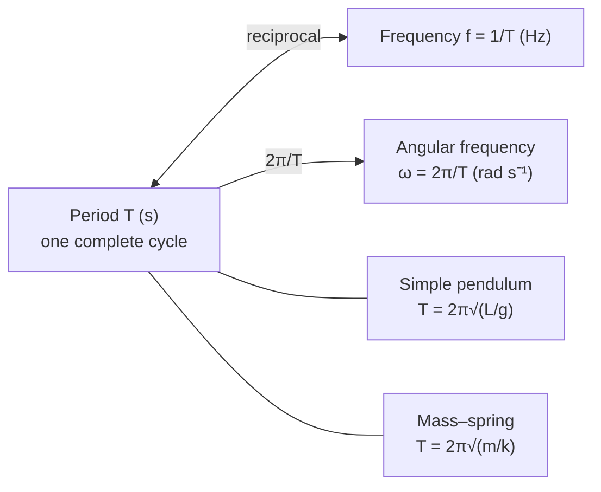

# Period

## Core Idea

The period is the time for one complete cycle of a repeating motion — one full swing of a pendulum, one full rotation, or the passage of one whole wave. A short period means a rapidly repeating event (high frequency).

## Symbol

`T`

## SI Unit

`s` (second)

## Scalar or Vector

Scalar. Magnitude only; positive.

## Definition

The period is the time taken for one complete oscillation, rotation, or wave cycle.

## Related Equations

- `T = 1 / f` — `T` = period (s), `f` = frequency (Hz).
- `T = 2π/ω` — `ω` = angular frequency (rad s⁻¹).
- Simple pendulum (small angle): `T = 2π√(L/g)` — `L` = length (m), `g` = 9.81 N kg⁻¹.
- Mass–spring: `T = 2π√(m/k)` — `m` = mass (kg), `k` = spring constant (N m⁻¹).
- Circular orbit: `T = 2πr/v` — `r` = radius (m), `v` = speed (m s⁻¹).

## How It Is Measured

Time a large number of complete cycles with a stopwatch (or light gate / data-logger) and divide by the number of cycles, then average over repeats. Timing many cycles greatly reduces the percentage uncertainty caused by reaction time.

## Graphical Meaning

On a displacement–time graph, the period is the time for one full cycle (peak to next equivalent peak). The gradient of a `T²` against `L` graph for a pendulum gives `4π²/g`, allowing `g` to be found.

## Foundation Links

- [[From-Speed-to-Velocity]] (rates and timing)

## Related Concepts

- [[Frequency]]
- [[Wavelength]]
- [[Amplitude]]

## Related Laws or Results

- None named (links to SHM and circular motion relations)

## Related Experiments

- Measuring g from the period of a simple pendulum

## Frontier Links

- [[Cosmology-Map]] (orbital periods and Kepler's third law — orientation only)

## Common Mistakes

- Confusing period with frequency (reciprocals)
- Timing a single cycle (high percentage uncertainty)
- Forgetting the small-angle condition for the pendulum formula

## Visuals

*Figure: Period T is the reciprocal of frequency f; it connects to angular frequency ω and to the SHM formulas for a pendulum and a mass–spring system.*
*Source: Authored for this vault (CC0). No external copyright.*

## Source Trace

- Source: OpenStax College Physics; The Physics Classroom; HyperPhysics (paraphrased, no copied text)
- OCR alignment: [[OCR-Physics-A-H556-Specification]]
