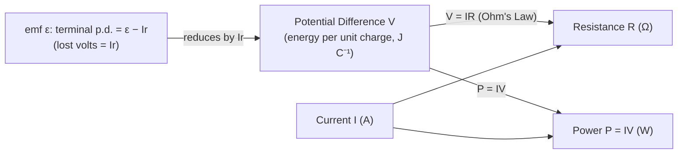

# Potential Difference

## Core Idea

Potential difference (voltage) is the energy transferred per unit charge as charge moves between two points in a circuit. It is the "push" that drives current through a component. Across a resistor it tells you how much electrical energy each coulomb loses; across a cell, the emf tells you how much energy each coulomb gains.

## Symbol

`V` (emf often `ε` or `E`)

## SI Unit

`V` (volt). `1 V = 1 J C⁻¹`.

## Scalar or Vector

Scalar. Magnitude only (with a sign indicating which way energy is transferred).

## Definition

Potential difference between two points is the energy transferred from electrical form per unit charge passing between them. Electromotive force (emf) is the energy transferred *to* electrical form per unit charge by a source.

## Related Equations

- `V = W / Q` — `V` = p.d. (V), `W` = energy transferred (J), `Q` = charge (C).
- `V = IR` — `I` = current (A), `R` = resistance (Ω). See [[Ohms-Law]].
- `ε = I(R + r)` — emf `ε` (V), internal resistance `r` (Ω). See [[Determining-Internal-Resistance]].
- `P = IV` — power (W).

## How It Is Measured

A voltmeter connected **in parallel** across the component (ideal voltmeter has very high resistance so it draws negligible current). Data-loggers record time-varying p.d.

## Graphical Meaning

On an [[IV-Characteristic]], p.d. is the x-axis (or y-axis depending on convention). For a cell, a graph of terminal p.d. against current is a straight line: y-intercept = emf, gradient = −(internal resistance).

## Foundation Links

- [[Energy-Quantity|Energy]] (GCSE-Foundations layer — energy per charge)

## Related Concepts

- [[Charge]]
- [[Current]]
- [[Resistance]]
- [[Internal-Resistance]]

## Related Laws or Results

- [[Ohms-Law]]

## Related Experiments

- [[Determining-Internal-Resistance]]

## Frontier Links

- [[Semiconductor-Physics-Map]] (p–n junction potential — orientation only)

## Common Mistakes

- Connecting the voltmeter in series
- Confusing emf with terminal p.d. (they differ by the "lost volts" across internal resistance)
- Treating voltage as something that "flows"

## Visuals

*Figure: Potential difference V sits at the centre of circuit relationships — defining resistance via Ohm's Law, power via P = IV, and linking to emf via internal resistance.*
*Source: Authored for this vault (CC0). No external copyright.*

## Source Trace

- Source: OpenStax College Physics; The Physics Classroom; HyperPhysics (paraphrased, no copied text)
- OCR alignment: [[OCR-Physics-A-H556-Specification]]
