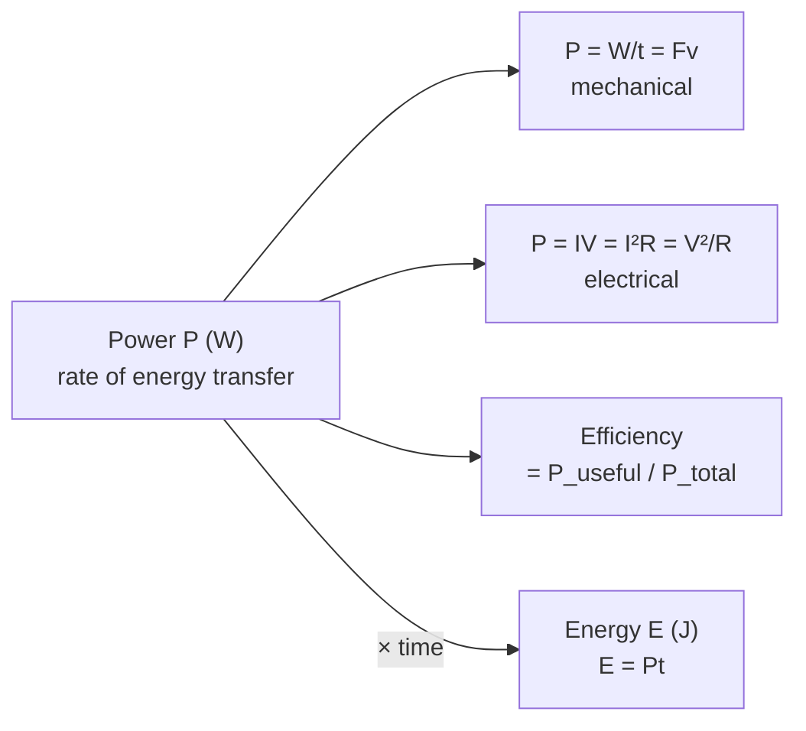

# Power

## Core Idea

Power is how *fast* energy is transferred or work is done. Two motors may do the same total work, but the more powerful one does it in less time. It is the difference between walking and sprinting up the same stairs.

> This is the A-Level **physical-quantity** page. For the prerequisite idea, see the GCSE-layer foundation page under Foundation Links.

## Symbol

`P`

## SI Unit

`W` (watt). `1 W = 1 J s⁻¹`.

## Scalar or Vector

Scalar. Magnitude only.

## Definition

Power is the rate of doing work, equivalently the rate of energy transfer.

## Related Equations

- `P = W / t` or `P = ΔE / t` — `P` = power (W), `W` = work (J), `ΔE` = energy transferred (J), `t` = time (s).
- `P = Fv` — `F` = force (N), `v` = speed (m s⁻¹) (force along the motion).
- Electrical: `P = IV = I²R = V²/R` — `I` = current (A), `V` = p.d. (V), `R` = resistance (Ω).
- Efficiency: `efficiency = useful power output / total power input`.

## How It Is Measured

Mechanically: measure energy transferred (or force and speed) and the time. Electrically: measure current and potential difference (joulemeter or `P = IV`).

## Graphical Meaning

The gradient of an energy–time graph equals power. The area under a power–time graph equals total energy transferred.

## Foundation Links

- [[Power]] (GCSE-Foundations layer — prerequisite idea)

## Related Concepts

- [[Work]]
- [[Energy]]
- [[Force]]
- [[Current]]
- [[Potential-Difference]]

## Related Laws or Results

- [[Ohms-Law]]

## Related Experiments

- Measuring the output power of a small electric motor lifting a load

## Frontier Links

- None at A-Level depth

## Common Mistakes

- Confusing power with energy or with force
- Forgetting power is a *rate* (per unit time)
- Mixing up useful and total power in efficiency

## Visuals

*Figure: Power P branches into mechanical (P = Fv) and electrical (P = IV) forms; multiplied by time it gives total energy transferred.*
*Source: Authored for this vault (CC0). No external copyright.*

## Source Trace

- Source: OpenStax College Physics; The Physics Classroom; HyperPhysics (paraphrased, no copied text)
- OCR alignment: [[OCR-Physics-A-H556-Specification]]
