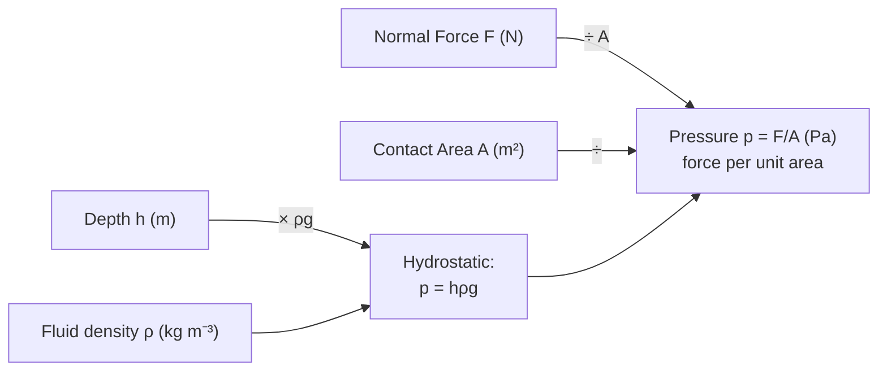

# Pressure

## Core Idea

Pressure is how concentrated a force is over an area. The same force through a sharp drawing pin produces a huge pressure that pierces a board, while the same force spread over a wide flat hand does not. In fluids, pressure increases with depth and acts equally in all directions.

## Symbol

`p` (sometimes `P`)

## SI Unit

`Pa` (pascal). `1 Pa = 1 N m⁻²`. Atmospheric pressure ≈ 1.0 × 10⁵ Pa.

## Scalar or Vector

Scalar in magnitude (the *force* it produces on a surface acts perpendicular to that surface).

## Definition

Pressure is the force acting normally per unit area.

## Related Equations

- `p = F / A` — `p` = pressure (Pa), `F` = normal force (N), `A` = area (m²).
- Hydrostatic pressure in a fluid: `p = hρg` — `h` = depth (m), `ρ` = fluid density (kg m⁻³), `g` = 9.81 N kg⁻¹.
- Ideal gas (frontier-adjacent): `pV = nRT` or `pV = NkT`.

## How It Is Measured

Manometers (liquid column height differences), Bourdon gauges, pressure sensors, or barometers for atmospheric pressure. In the lab, hydrostatic pressure is checked by varying depth and observing the change in height of a connected liquid column.

## Graphical Meaning

A graph of fluid pressure against depth is a straight line of gradient `ρg` (intercept = surface/atmospheric pressure). For a fixed-temperature gas, a `p` against `1/V` graph is linear (Boyle's law).

## Foundation Links

- [[Force]] (GCSE-Foundations layer — prerequisite idea)

## Related Concepts

- [[Force]]
- [[Density]]
- [[Area]]

## Related Laws or Results

- None directly (defining relationship; links to gas laws)

## Related Experiments

- Investigating how fluid pressure varies with depth

## Frontier Links

- [[Cosmology-Map]] (radiation pressure — orientation only)

## Common Mistakes

- Using total area instead of contact area
- Forgetting the force must be perpendicular to the surface
- Confusing pressure with force

## Visuals

*Figure: Pressure p = F/A for a surface force, and p = hρg for a fluid column of depth h — both routes lead to the same unit Pa = N m⁻².*
*Source: Authored for this vault (CC0). No external copyright.*

## Source Trace

- Source: OpenStax College Physics; The Physics Classroom; HyperPhysics (paraphrased, no copied text)
- OCR alignment: [[OCR-Physics-A-H556-Specification]]
