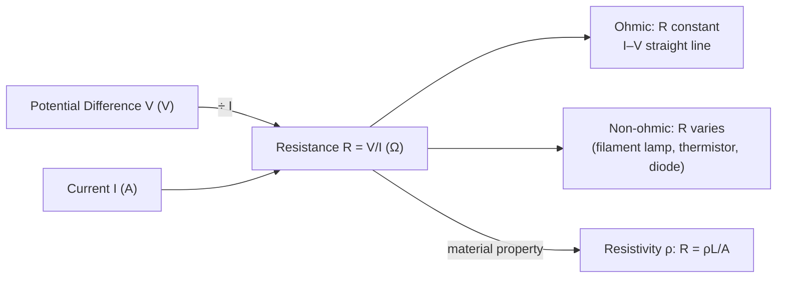

# Resistance

## Core Idea

Resistance measures how strongly a component opposes the flow of electric current. For a given voltage, a high-resistance component allows only a small current. Resistance arises because charge carriers collide with the lattice, transferring energy as heat.

## Symbol

`R`

## SI Unit

`Ω` (ohm). `1 Ω = 1 V A⁻¹`.

## Scalar or Vector

Scalar. Magnitude only; always positive for passive components.

## Definition

The resistance of a component is the ratio of the potential difference across it to the current through it.

## Related Equations

- `R = V / I` — `R` = resistance (Ω), `V` = p.d. (V), `I` = current (A).
- `R = ρL / A` — `ρ` = resistivity (Ω m), `L` = length (m), `A` = cross-sectional area (m²). See [[Resistivity]].
- Series: `R_total = R₁ + R₂ + …`. Parallel: `1/R_total = 1/R₁ + 1/R₂ + …`.
- `P = I²R = V²/R` — power dissipated (W).

## How It Is Measured

Measure p.d. (voltmeter in parallel) and current (ammeter in series) and compute `R = V/I`, or use an ohmmeter / multimeter. Plotting a full [[IV-Characteristic]] reveals whether resistance is constant (ohmic) or varies (filament lamp, diode, thermistor).

## Graphical Meaning

On an [[IV-Characteristic]] (I vs V), resistance is the **reciprocal of the gradient** (`R = V/I`). A straight line through the origin indicates a constant resistance (ohmic behaviour); a curve indicates resistance that changes with current/temperature.

## Foundation Links

- [[Energy]] (GCSE-Foundations layer — energy dissipated as heat)

## Related Concepts

- [[Current]]
- [[Potential-Difference]]
- [[Resistivity]]
- [[Internal-Resistance]]

## Related Laws or Results

- [[Ohms-Law]]

## Related Experiments

- [[Determining-Internal-Resistance]]

## Frontier Links

- [[Semiconductor-Physics-Map]] (superconductivity — orientation only)

## Common Mistakes

- Assuming all components are ohmic (constant `R`)
- Reading the gradient (not its reciprocal) of an I–V graph as resistance
- Forgetting resistance depends on temperature

## Visuals

*Figure: Resistance R = V/I; for ohmic conductors R is constant (straight I–V line); for non-ohmic components R changes with current or temperature. Resistivity ρ describes the material independently of sample size.*
*Source: Authored for this vault (CC0). No external copyright.*

## Source Trace

- Source: OpenStax College Physics; The Physics Classroom; HyperPhysics (paraphrased, no copied text)
- OCR alignment: [[OCR-Physics-A-H556-Specification]]
