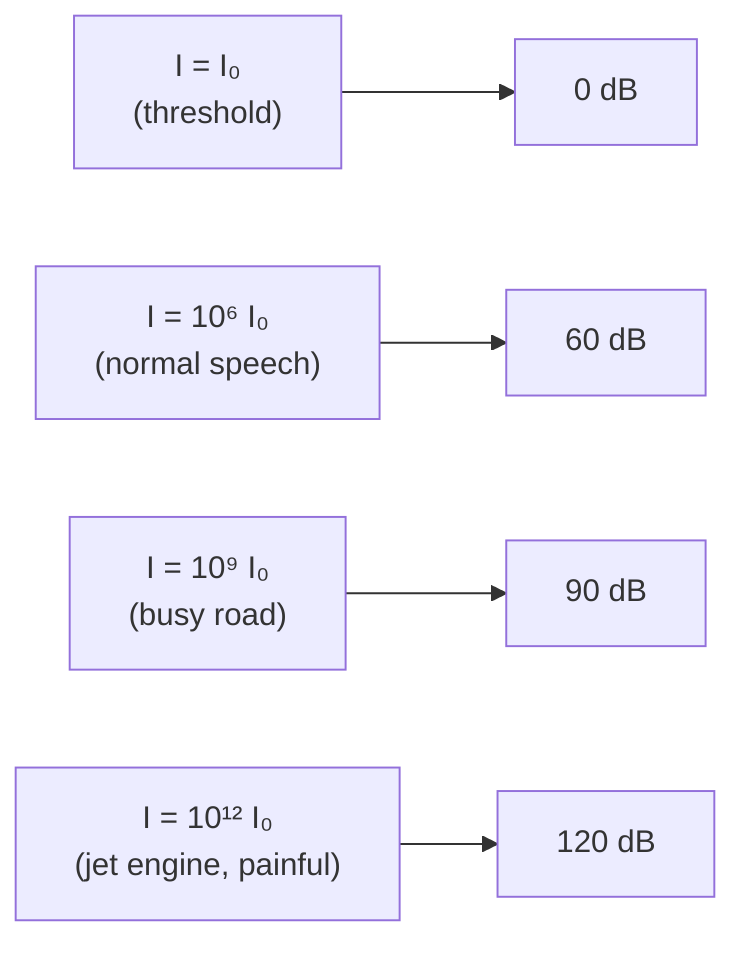

# Sound Intensity Level

## Core Idea

Sound intensity level (SIL) is a logarithmic measure of how strong a sound is relative to a fixed reference at the threshold of human hearing. Using a log scale compresses an enormous physical range (a quiet whisper to a jet engine spans about $10^{12}$) into a comfortable scale of roughly 0 to 120 dB that also matches the way the ear perceives loudness.

## Symbol

- $L$ (or $L_I$ for intensity level; $L_p$ for the related sound pressure level)

## SI Unit

- decibel, dB (a dimensionless ratio; one bel = factor of 10 in intensity, one decibel = one tenth of a bel)

## Scalar or Vector

- Scalar

## Definition

For a sound of [[Intensity]] $I$ (in W m$^{-2}$), the sound intensity level is

$$L = 10 \log_{10}\!\left(\frac{I}{I_0}\right)$$

with the reference intensity

$$I_0 = 1.0 \times 10^{-12}\,\text{W m}^{-2}$$

— the canonical threshold of hearing for a 1 kHz tone in a healthy young adult ear. So:

- $I = I_0 \Rightarrow L = 0\,\text{dB}$ — at the threshold.
- $I = 10 I_0 \Rightarrow L = 10\,\text{dB}$ — a 10× rise in intensity is +10 dB.
- $I = 10^{12} I_0 \Rightarrow L = 120\,\text{dB}$ — threshold of pain.

A useful rule: every doubling of $I$ adds about $+3\,\text{dB}$; every tenfold rise adds exactly $+10\,\text{dB}$.

## Related Equations

- Combining two uncorrelated sources of intensity $I_1$ and $I_2$:

$$L_\text{total} = 10 \log_{10}\!\left(\frac{I_1 + I_2}{I_0}\right)$$

Two equal sources together give $+3\,\text{dB}$, not double the level.

- Inverse-square fall-off from a point source: doubling the distance halves $I$ four times… actually quarters it, so the level falls by $10 \log_{10} 4 \approx 6\,\text{dB}$ per distance doubling in free field.

## How It Is Measured

- A **sound level meter** uses a calibrated microphone (often a polarised condenser type) feeding a logarithmic amplifier. The meter applies a weighting filter — most commonly **A-weighting** (dBA) — which mimics the frequency response of the human ear at moderate levels, attenuating very low and very high frequencies.
- Workplace noise exposure is specified in dBA (e.g. UK Control of Noise at Work Regulations: 80 dBA lower action level, 85 dBA upper action level, 87 dBA exposure limit).
- For pure-tone audiometry the meter is replaced by a calibrated headphone delivering known SIL at each test frequency; the patient's threshold map gives an **audiogram**.

## Graphical Meaning

On a graph of $L$ vs $\log I$, the relation is a straight line of gradient 10 (dB per decade of intensity). On a graph of $L$ vs $I$ directly, the curve flattens fast — a visual reminder of why dB matters: 60 dB and 70 dB look very different to the ear but cover only 9 µW m$^{-2}$ of extra intensity. **Equal-loudness contours** (see [[Physics-of-the-Ear]]) plot $L$ vs [[Frequency]] for tones of equal perceived loudness, and show why dBA filtering is needed.

## Foundation Links

- [[Intensity]]
- [[Frequency]]
- Logarithms (Maths-Skills)

## Related Concepts

- [[Physics-of-the-Ear]]
- Equal-loudness curves

## Related Laws or Results

- Inverse-square law for point sources in free field

## Related Experiments

- Audiogram measurement
- Noise survey with a calibrated sound level meter

## Frontier Links

- Active noise cancellation (phase-inverse pressure waves)
- Psychoacoustic compression in audio codecs

## Common Mistakes

- Adding decibel values arithmetically: 60 dB + 60 dB ≠ 120 dB; two equal sources give about 63 dB.
- Dropping the reference $I_0$ — the dB is only meaningful relative to a stated reference.
- Confusing dB (raw level) with dBA (A-weighted to ear response). Workplace and audiology values are almost always dBA.
- Treating the threshold $I_0$ as a property of physics rather than of human hearing.

## Visuals

### Intensity ratio vs decibels

*Figure: every ×10 in physical intensity adds 10 dB to the level; perception keeps pace.*
*Source: Authored for this vault (CC0). No external copyright.*

### From Wikimedia

<!-- wiki-images: yes -->

#### Equal-loudness contours
![[_attachments/03_Physical-Quantities/Sound-Intensity-Level--wiki-equal-loudness-contours.svg]]
*Figure: each curve traces the sound intensity level (dB) needed at each frequency for tones to sound equally loud — the ear is far less sensitive at low frequencies.*
*Source: Wikimedia Commons — [Equal-loudness contours comparison with Robinson-Dadson curves.svg](https://commons.wikimedia.org/wiki/File:Equal-loudness_contours_comparison_with_Robinson-Dadson_curves.svg) — Public domain — Lindosland. Retrieved 2026-06-27.*

## Source Trace

- Source: [[AQA-Physics-7407-7408-Specification]] §3.10.2
- Public source: HyperPhysics (Decibel); OpenStax College Physics — Sound Intensity and Sound Level
- Section/Page: Optional unit 3.10.2 — physics of hearing
