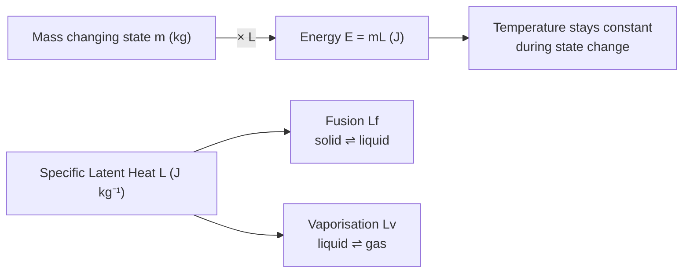

# Specific Latent Heat

## Core Idea

Specific latent heat is the energy needed to change the state of 1 kg of a substance without any change in temperature.

## Symbol

- $L$ (with $L_f$ for fusion, $L_v$ for vaporisation)

## SI Unit

- J kg⁻¹

## Scalar or Vector

- Scalar

## Definition

The specific latent heat of a substance is the energy required per unit mass to change its state at constant temperature. **Specific latent heat of fusion** is for solid ⇌ liquid; **specific latent heat of vaporisation** is for liquid ⇌ gas.

## Related Equations

$$ E = mL $$

where $E$ is energy transferred (J), $m$ is mass changing state (kg) and $L$ is the specific latent heat (J kg⁻¹). During the change of state the temperature is constant, so there is no $mc\Delta\theta$ term.

## How It Is Measured

Electrically: supply known energy $E = VIt$ to melt or boil a measured mass $m$ (e.g. an electrical heater in melting ice, or boiling water with a balance). Then $L = \dfrac{VIt}{m}$. A control with the heater off corrects for energy gained from or lost to the surroundings.

## Graphical Meaning

On a graph of energy supplied against temperature for a fixed mass, the **flat plateaus** are the changes of state. The horizontal length of a plateau (energy at constant temperature) divided by the mass gives $L$. The energy raises the potential part of [[Internal-Energy]] (breaking bonds), not the kinetic part, so [[Temperature]] does not change.

## Foundation Links

- [[Energy-Quantity|Energy]]
- [[Conservation-of-Energy]]

## Related Concepts

- [[Internal-Energy]]
- [[States-of-Matter]]
- [[Temperature]]

## Related Laws or Results

- [[Conservation-of-Energy]]

## Related Experiments

- [[Measuring-Specific-Heat-Capacity]]

## Frontier Links

- Latent heat in atmospheric physics and phase-change energy storage (beyond A-Level)

## Common Mistakes

- [[Confusing-Heat-and-Temperature]]
- Adding a $\Delta\theta$ term during a change of state
- Confusing latent heat of fusion with vaporisation

## Visuals

*Figure: E = mL — the energy needed to change state depends only on mass and the type of latent heat (fusion or vaporisation). Temperature does not change during the process; the energy raises the potential energy of the molecules, not their kinetic energy.*
*Source: Authored for this vault (CC0). No external copyright.*

## Source Trace

- Source: OpenStax College Physics; HyperPhysics; The Physics Classroom — paraphrased, no copied text
- Section/Page: OCR alignment: [[OCR-Physics-A-H556-Specification]] (Module 5.1.2)
