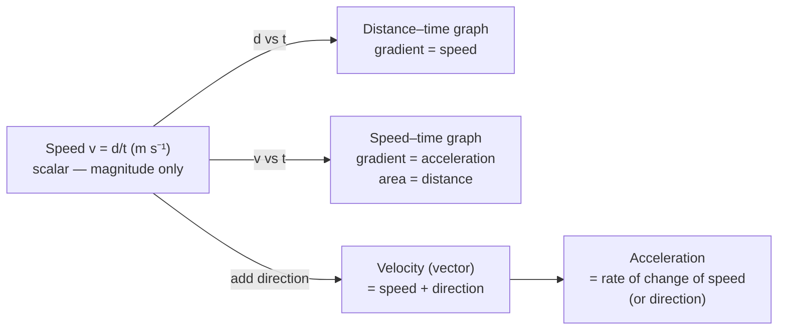

# Speed

## Core Idea

Speed tells you how fast an object is moving — how much distance it covers per unit time — without saying anything about direction. A speedometer reads instantaneous speed.

## Symbol

`v` (or `s` in some texts; `c` for the speed of light)

## SI Unit

`m s⁻¹` (metres per second)

## Scalar or Vector

Scalar. Magnitude only; always positive or zero.

## Definition

Speed is the rate of change of distance with time. Average speed is total distance divided by total time; instantaneous speed is the limiting value over a vanishingly small time interval.

## Related Equations

- $\text{average speed} = \text{total distance} / \text{total time}$ → $\bar{v} = d / t$ — `d` = distance (m), `t` = time (s).
- Instantaneous speed = magnitude of instantaneous velocity = $|v|$.
- $v = u + at$ (constant acceleration, magnitudes) — `u` = initial speed (m s⁻¹), `a` = acceleration (m s⁻²).

## How It Is Measured

Light gates with a card of known length, ticker timers, radar/Doppler guns, motion sensors, or video analysis (distance per known time interval).

## Graphical Meaning

On a distance–time graph, speed is the **gradient**. On a speed–time graph the gradient is the magnitude of acceleration and the area beneath gives distance.

## Foundation Links

- [[From-Speed-to-Velocity]]
- [[From-Distance-to-Displacement]]

## Related Concepts

- [[Velocity]]
- [[Distance]]
- [[Acceleration]]

## Related Laws or Results

- None directly (kinematic definition)

## Related Experiments

- Measuring speed with light gates

## Frontier Links

- [[Relativity-Map]] (the speed of light as a universal limit)

## Common Mistakes

- Confusing speed with velocity
- Confusing average speed with average of speeds
- Treating speed as a vector

## Visuals

*Figure: Speed is the scalar magnitude of velocity. On a distance–time graph the gradient gives speed; on a speed–time graph the gradient gives acceleration and the area gives distance.*
*Source: Authored for this vault (CC0). No external copyright.*

### From Wikipedia

<!-- wiki-images: yes -->

#### Motorcyclist in Midtown Manhattan-L1002704

![[_attachments/03_Physical-Quantities/Speed--wiki-motorcyclist-in-midtown-manhattan-l10027.jpg]]
*Figure: from Wikipedia article "Speed".*
*Source: Wikimedia Commons — [Motorcyclist_in_Midtown_Manhattan-L1002704.jpg](https://commons.wikimedia.org/wiki/File:Motorcyclist_in_Midtown_Manhattan-L1002704.jpg). Retrieved 2026-05-20.*

#### 20230703 Average speed of bowling ball versus travel time

![[_attachments/03_Physical-Quantities/Speed--wiki-20230703-average-speed-of-bowling-ball-v.svg]]
*Figure: from Wikipedia article "Speed".*
*Source: Wikimedia Commons — [20230703 Average speed of bowling ball versus travel time.svg](https://commons.wikimedia.org/wiki/File:20230703_Average_speed_of_bowling_ball_versus_travel_time.svg). Retrieved 2026-05-20.*

#### Motorcyclist in Midtown Manhattan-L1002704

![[_attachments/03_Physical-Quantities/Speed--wiki-motorcyclist-in-midtown-manhattan-l10027.jpg]]
*Figure: from Wikipedia article "Speed".*
*Source: Wikimedia Commons — [Motorcyclist in Midtown Manhattan-L1002704.jpg](https://commons.wikimedia.org/wiki/File:Motorcyclist_in_Midtown_Manhattan-L1002704.jpg). Retrieved 2026-05-20.*

## Source Trace

- Source: OpenStax College Physics; The Physics Classroom; HyperPhysics (paraphrased, no copied text)
- OCR alignment: [[OCR-Physics-A-H556-Specification]]
