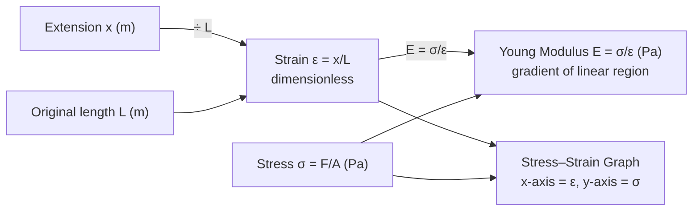

# Strain

## Core Idea

Strain measures how much a material has stretched *relative to its original length*. A 1 mm extension matters far more for a 10 mm sample than for a 10 m sample — strain captures exactly this proportional change, so it is the fair way to compare deformation.

## Symbol

`ε` (Greek epsilon)

## SI Unit

None — it is a ratio of two lengths and therefore **dimensionless** (sometimes expressed as a percentage).

## Scalar or Vector

Scalar. Magnitude only.

## Definition

Tensile strain is the extension of a sample divided by its original length.

## Related Equations

- `ε = x / L` — `ε` = strain (no unit), `x` = extension (m), `L` = original length (m).
- Young modulus: `E = σ / ε` — `σ` = stress (Pa). See [[Young-Modulus]].
- Percentage strain `= ε × 100%`.

## How It Is Measured

Measure the original length `L` with a metre rule or tape, then measure the extension `x` as load is added (a marker plus a fixed reference scale, or a travelling microscope for small extensions). Strain is the ratio `x/L`. Central to [[Measuring-Young-Modulus]].

## Graphical Meaning

On a [[Stress-Strain-Graph]] strain is the x-axis. Within the linear region, stress is proportional to strain (gradient = Young modulus). The elastic region returns to zero strain on unloading; permanent strain remains after the elastic limit.

## Foundation Links

- [[Force]] (GCSE-Foundations layer — prerequisite idea)

## Related Concepts

- [[Stress]]
- [[Young-Modulus]]
- [[Displacement]]

## Related Laws or Results

- [[Hookes-Law]]

## Related Experiments

- [[Measuring-Young-Modulus]]

## Frontier Links

- None at A-Level depth

## Common Mistakes

- Giving strain a unit (it has none)
- Dividing by the extended length instead of the original length
- Confusing strain with extension

## Visuals

*Figure: Strain ε = x/L (dimensionless) is the x-axis of the stress–strain graph. In the linear (Hookean) region the gradient equals the Young modulus E.*
*Source: Authored for this vault (CC0). No external copyright.*

## Source Trace

- Source: OpenStax College Physics; The Physics Classroom; HyperPhysics (paraphrased, no copied text)
- OCR alignment: [[OCR-Physics-A-H556-Specification]]
