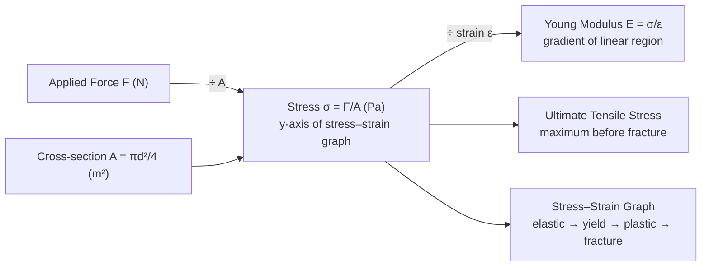

# Stress

## Core Idea

Stress measures how hard the internal material of an object is being pulled (or pushed) per unit of cross-sectional area. A thin wire and a thick rod under the same load experience very different stresses, which is why the thin wire breaks first.

## Symbol

`σ` (Greek sigma)

## SI Unit

`Pa` (pascal) `= N m⁻²` (often MPa or GPa for materials)

## Scalar or Vector

Treated as a scalar magnitude at A-Level (tensile or compressive depending on sign/direction of the load).

## Definition

Tensile stress is the force applied per unit cross-sectional area, perpendicular to that area.

## Related Equations

- `σ = F / A` — `σ` = stress (Pa), `F` = applied force (N), `A` = cross-sectional area (m²).
- Young modulus: `E = σ / ε` — `ε` = strain (dimensionless). See [[Young-Modulus]].
- Breaking (ultimate tensile) stress is the maximum stress a material withstands before fracture.

## How It Is Measured

Apply a known force (hanging masses) to a sample of measured cross-section. The area is found from a diameter measured with a micrometer (`A = πd²/4`). Stress is then `F/A`. Used in the [[Measuring-Young-Modulus]] experiment.

## Graphical Meaning

On a [[Stress-Strain-Graph]] (stress on the y-axis, strain on the x-axis), the initial gradient is the **Young modulus**, the area under the curve is the energy stored per unit volume, and key features include the limit of proportionality, elastic limit, yield, and breaking stress.

## Foundation Links

- [[Force]] (GCSE-Foundations layer — prerequisite idea)

## Related Concepts

- [[Strain]]
- [[Young-Modulus]]
- [[Pressure]]
- [[Force]]

## Related Laws or Results

- [[Hookes-Law]]

## Related Experiments

- [[Measuring-Young-Modulus]]

## Frontier Links

- [[Semiconductor-Physics-Map]] (strained-silicon engineering — orientation only)

## Common Mistakes

- Using diameter instead of radius (or forgetting `A = πd²/4`)
- Confusing stress with pressure (similar units, different context)
- Using the original area after large deformation

## Visuals

*Figure: Stress σ = F/A (Pa) is the y-axis of the stress–strain graph. The initial gradient is the Young modulus; the stress at fracture is the ultimate tensile stress.*
*Source: Authored for this vault (CC0). No external copyright.*

## Source Trace

- Source: OpenStax College Physics; The Physics Classroom; HyperPhysics (paraphrased, no copied text)
- OCR alignment: [[OCR-Physics-A-H556-Specification]]
