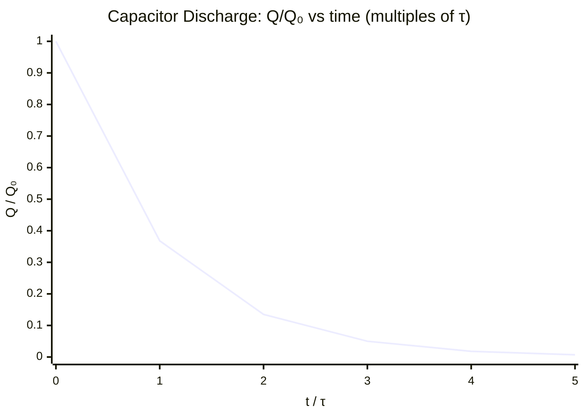

# Time Constant

## Core Idea

The time constant measures how quickly a capacitor charges or discharges through a resistor — the larger it is, the slower the exponential change.

## Symbol

- τ (tau)

## SI Unit

- second (s). Dimensionally, τ = RC, and (ohm)(farad) = (V A⁻¹)(C V⁻¹) = (C A⁻¹) = s.

## Scalar or Vector

- Scalar.

## Definition

The time constant of a resistor–capacitor circuit is the product of resistance and capacitance:

- τ = R C
  - τ = time constant, seconds (s)
  - R = circuit resistance, ohms (Ω)
  - C = [[Capacitance]], farads (F)

It is the time taken for the charge, current, or voltage on the [[Capacitor]] to fall to 1/e (≈ 37%) of its initial value during discharge — or to rise to (1 − 1/e) ≈ 63% of its final value during charging.

## Related Equations

- Q = Q₀ e^(−t/RC) (see [[Capacitor-Discharge-Equation]])
- After one time constant: Q = Q₀/e ≈ 0.37 Q₀
- After 5τ the capacitor is regarded as fully discharged (< 1% remaining)

## How It Is Measured

Discharge the capacitor through a known resistor and log voltage against time (datalogger or voltmeter and stopwatch). Either read the time for the voltage to fall to 37% of its initial value, or plot ln V against t: the [[Capacitor-Discharge-Graph]] gives a straight line of gradient −1/τ, so τ = −1/gradient.

## Graphical Meaning

On a ln V (or ln Q) versus t graph the gradient is −1/RC, so the time constant is the negative reciprocal of the gradient. On the raw exponential decay curve, τ is the time for the value to fall by a factor of e, and equals the intercept where the initial tangent meets the time axis.

## Foundation Links

- [[Energy]]
- [[Charge]]

## Related Concepts

- [[Capacitor]]
- [[Capacitance]]

## Related Laws or Results

- [[Capacitor-Discharge-Equation]]

## Related Experiments

- [[Analysing-Capacitor-Charge-and-Discharge]]

## Frontier Links

- [[Semiconductor-Physics-Map]]

## Common Mistakes

- Treating τ as the time to fully discharge (it is the time to reach 37%, not 0%).
- Forgetting to convert μF to F before multiplying by R.
- Using 50% (half-life) instead of 37% for the time constant; the half-life is t½ = τ ln 2 ≈ 0.69τ.

## Visuals

*Figure: Charge Q falls to Q₀/e ≈ 0.37 Q₀ after one time constant τ = RC. After 5τ less than 1% remains — the capacitor is regarded as fully discharged. The curve is exponential: Q = Q₀ e^(−t/τ).*
*Source: Authored for this vault (CC0). No external copyright.*

## Source Trace

- Source: OpenStax College Physics; HyperPhysics; Physics LibreTexts — no copied text
- Section/Page: OCR alignment: [[OCR-Physics-A-H556-Specification]] (M6.1)
