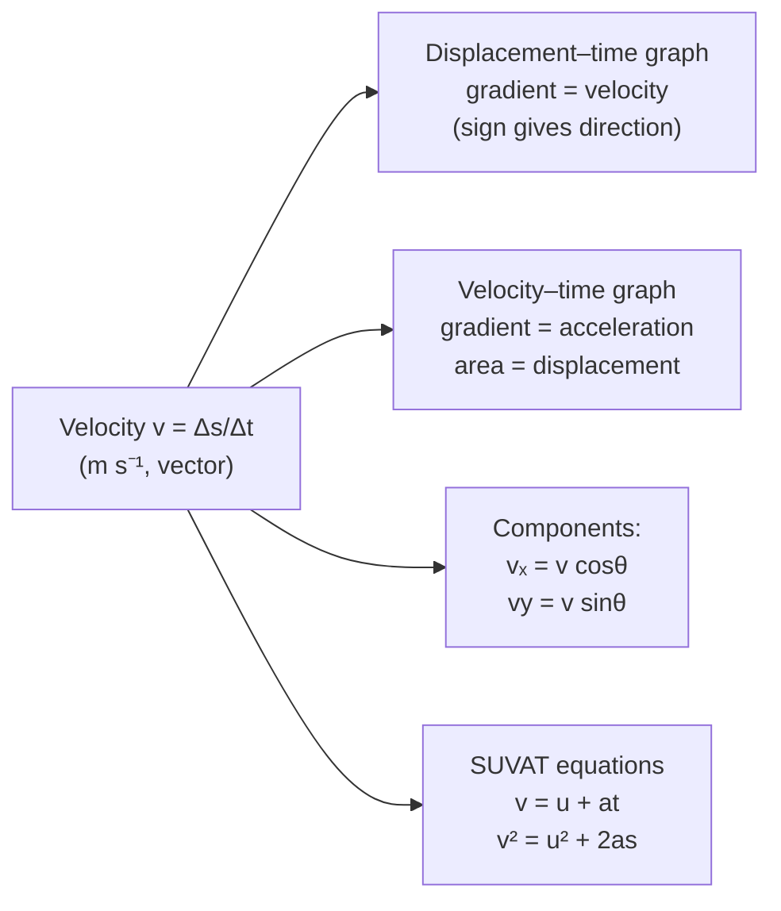

# Velocity

## Core Idea

Velocity is speed with a direction: it states how fast an object moves and which way it is going. Two cars travelling at 30 m s⁻¹ in opposite directions have the same speed but different velocities.

## Symbol

`v`

## SI Unit

`m s⁻¹` (metres per second)

## Scalar or Vector

Vector. Magnitude (= speed) and direction. A change in direction alone changes the velocity even at constant speed.

## Definition

Velocity is the rate of change of displacement with time. Average velocity is displacement divided by time taken; instantaneous velocity is the limiting value over a very short time interval, tangent to the path.

## Related Equations

- $\bar{v} = \Delta s / \Delta t$ — `Δs` = displacement (m), `Δt` = time (s).
- SUVAT: $v = u + at$, $v^2 = u^2 + 2as$ — `u` = initial velocity (m s⁻¹), `a` = acceleration (m s⁻²), `s` = displacement (m), `t` = time (s).
- Components: $v_x = v \cos\theta$, $v_y = v \sin\theta$.

## How It Is Measured

Speed measured by light gates / motion sensors combined with an observed or recorded direction. In projectile and 2-D work, horizontal and vertical components are tracked separately, often by video analysis.

## Graphical Meaning

- Gradient of a displacement–time graph = velocity (sign gives direction).
- On a [[Velocity-Time-Graph]], gradient = acceleration and area under the curve = displacement.

## Foundation Links

- [[From-Speed-to-Velocity]]
- [[From-Distance-to-Displacement]]

## Related Concepts

- [[Speed]]
- [[Displacement]]
- [[Acceleration]]
- [[Momentum]]

## Related Laws or Results

- [[Newton-Second-Law]]
- [[Conservation-of-Momentum]]

## Related Experiments

- Velocity measurement with light gates and motion sensors

## Frontier Links

- [[Relativity-Map]] (velocity addition at high speeds)

## Common Mistakes

- Using speed when velocity (direction) is required
- Assuming zero velocity means zero acceleration
- Adding velocities arithmetically instead of as vectors

## Visuals

*Figure: Velocity v is displacement per unit time (vector). The displacement–time gradient gives v; the velocity–time graph gradient gives acceleration; its area gives displacement.*
*Source: Authored for this vault (CC0). No external copyright.*

### From Wikipedia

<!-- wiki-images: yes -->

#### US Navy 040501-N-1336S-037 The U.S. Navy sponsored Chevy Monte Carlo NASCAR leads a pack into turn four at California Speedway

![[_attachments/03_Physical-Quantities/Velocity--wiki-us-navy-040501-n-1336s-037-the-us-navy-s.jpg]]
*Figure: from Wikipedia article "Velocity".*
*Source: Wikimedia Commons — [US_Navy_040501-N-1336S-037_The_U.S._Navy_sponsored_Chevy_Monte_Carlo_NASCAR_leads_a_pack_into_turn_four_at_California_Speedway.jpg](https://commons.wikimedia.org/wiki/File:US_Navy_040501-N-1336S-037_The_U.S._Navy_sponsored_Chevy_Monte_Carlo_NASCAR_leads_a_pack_into_turn_four_at_California_Speedway.jpg). Retrieved 2026-05-20.*

#### Kinematics

![[_attachments/03_Physical-Quantities/Velocity--wiki-kinematics.svg]]
*Figure: from Wikipedia article "Velocity".*
*Source: Wikimedia Commons — [Kinematics.svg](https://commons.wikimedia.org/wiki/File:Kinematics.svg). Retrieved 2026-05-20.*

#### Radial and tangential

![[_attachments/03_Physical-Quantities/Velocity--wiki-radial-and-tangential.svg]]
*Figure: from Wikipedia article "Velocity".*
*Source: Wikimedia Commons — [Radial and tangential.svg](https://commons.wikimedia.org/wiki/File:Radial_and_tangential.svg). Retrieved 2026-05-20.*

## Source Trace

- Source: OpenStax College Physics; The Physics Classroom; HyperPhysics (paraphrased, no copied text)
- OCR alignment: [[OCR-Physics-A-H556-Specification]]
