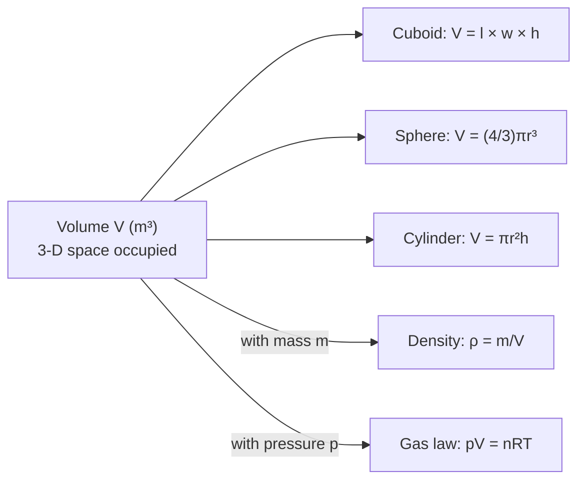

# Volume

## Core Idea

Volume measures the amount of three-dimensional space an object occupies or
encloses.

## Symbol

- V

## SI Unit

- cubic metre (m³)

## Scalar or Vector

- Scalar

## Definition

Volume is the space inside a three-dimensional region, found by multiplying
three perpendicular lengths for a cuboid: $V = \text{length} \times \text{width} \times \text{height}$.

## Related Equations

- Cuboid: $V = l \times w \times h$
- Sphere: $V = \frac{4}{3}\pi r^3$
- It appears in [[Density]]: $\rho = m / V$
- Used with [[Pressure]] in gas relationships (pV behaviour for gases)

## How It Is Measured

Regular solids: measure lengths and apply a formula. Irregular solids:
displacement of liquid in a measuring cylinder (the volume of liquid pushed up
equals the object's volume). Liquids: a measuring cylinder or burette.

## Graphical Meaning

In gas work, the area or position on a pressure–volume diagram represents
states of the gas; volume itself is a measured three-dimensional quantity.

## Foundation Links

- [[Area]]

## Related Concepts

- [[Density]]

## Related Laws or Results

- [[Density]] equation $\rho = m / V$

## Related Experiments

- Finding the density of an irregular solid by liquid displacement

## Frontier Links

- Volume changes and scaling in stellar and atomic physics

## Common Mistakes

- Forgetting to cube the unit (m³, not m or m²).
- Mixing unit prefixes (1 cm³ = 1 × 10⁻⁶ m³, not 10⁻²).

## Visuals

*Figure: Volume V (m³) links to density via ρ = m/V and to gas behaviour via pV = nRT. Key formulae for common shapes avoid needing to measure 3-D space directly.*
*Source: Authored for this vault (CC0). No external copyright.*

## Source Trace

OpenStax College Physics; HyperPhysics; The Physics Classroom — no copied text.

OCR alignment: [[OCR-Physics-A-H556-Specification]]
