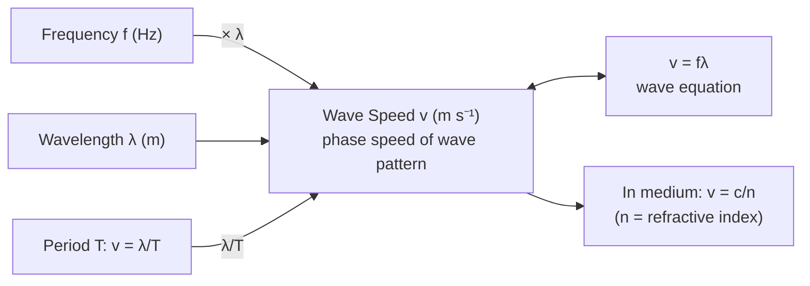

# Wave Speed

## Core Idea

Wave speed is how fast a wave pattern (a crest, a wavefront, or a point of fixed phase) travels through a medium — not how fast the particles of the medium move.

## Symbol

- `v` (sometimes `c` for electromagnetic waves in a vacuum)

## SI Unit

- metres per second, `m s⁻¹`

## Scalar or Vector

- Scalar in magnitude (`speed`); the associated wave velocity is a vector pointing along the direction of energy propagation.

## Definition

The wave speed is the distance travelled by a point of constant phase per unit time. In one period `T` the pattern advances exactly one [[Wavelength]] `λ`, so $v = \lambda / T = f \lambda$, where `f` is the [[Frequency]].

It must be distinguished from the **particle speed** — the speed of an individual oscillating particle of the medium, which varies continuously through each cycle and is generally different from `v`.

## Related Equations

- $v = f \lambda$ — see [[Wave-Speed-Equation]]
- $v = \lambda / T$, using $f = 1 / T$ with [[Period]] `T`
- For light in a medium, $v = c / n$ where `n` is the [[Refractive-Index]] (see [[Snell-Law]])

## How It Is Measured

- **Sound:** time an echo over a known distance, or use a microphone and oscilloscope to measure wavelength of a known-frequency tone, then $v = f \lambda$.
- **Waves on a string:** measure frequency for a standing-wave pattern of known length (see [[Standing-Waves]]).
- **Water/ripple waves:** stroboscope and ruler in a ripple tank.
- **Light:** derived from `c` and the measured [[Refractive-Index]].

## Graphical Meaning

On a distance–time graph of a single wavefront, the gradient is the wave speed. On a displacement–position ("snapshot") graph the wavelength is read off, and combined with frequency from a displacement–time graph it gives $v = f \lambda$.

## Foundation Links

- [[Speed]]
- [[Waves-GCSE|Waves]]

## Related Concepts

- [[Wave-Refraction]]
- [[Wave-Reflection]]
- [[Standing-Waves]]
- [[Superposition]]

## Related Laws or Results

- [[Wave-Speed-Equation]]
- [[Law-of-Reflection]]
- [[Snell-Law]]

## Related Experiments

- Measuring the speed of sound by resonance or time-of-flight.

## Frontier Links

- In a dispersive medium the **phase speed** (this quantity) differs from the **group speed** at which energy and information travel — explored beyond A-Level in [[Quantum-Mechanics-Map]] via the [[De-Broglie-Equation]].

## Common Mistakes

- Confusing wave speed with the speed of the medium's particles.
- Assuming wave speed changes with frequency in a non-dispersive medium (it does not — `λ` changes instead).
- Thinking speed changes on [[Wave-Reflection]] (it does not; the medium is unchanged).

## Visuals

*Figure: Wave speed v = fλ. For a given medium v is fixed — increasing f means λ decreases proportionally. In a medium of refractive index n the speed is c/n.*
*Source: Authored for this vault (CC0). No external copyright.*

## Source Trace

- Source: OpenStax College Physics; HyperPhysics; The Physics Classroom — paraphrased, no copied text.
- OCR alignment: [[OCR-Physics-A-H556-Specification]]
