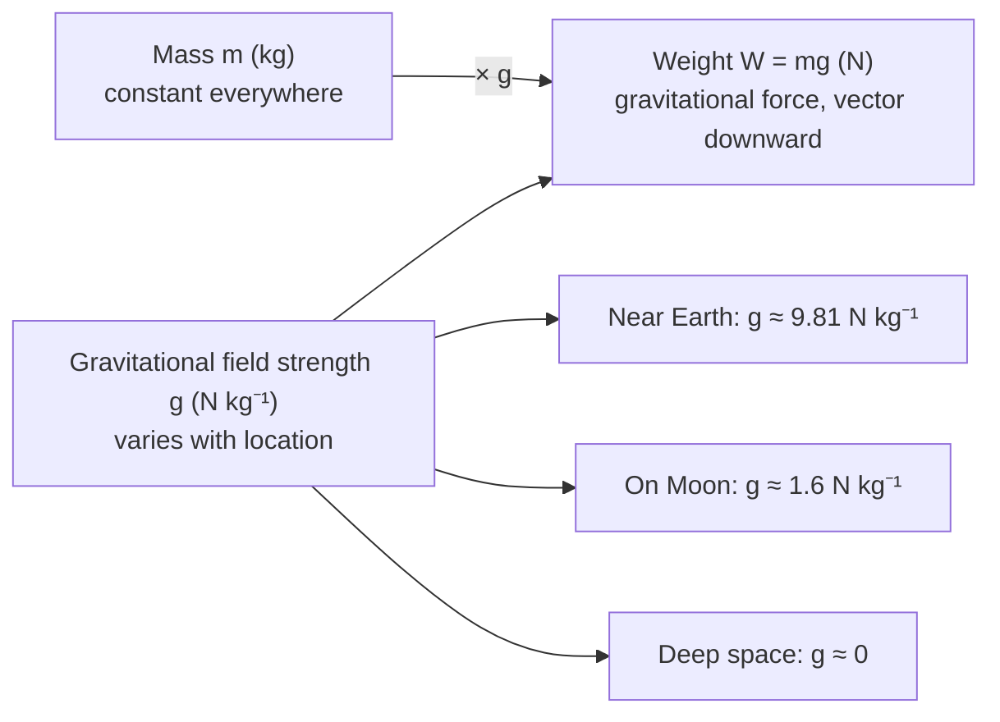

# Weight

## Core Idea

Weight is the gravitational force acting on an object's mass. It depends on where the object is: the same body weighs less on the Moon because the Moon's gravitational field is weaker, even though its mass is unchanged.

## Symbol

`W` (sometimes `F_g`)

## SI Unit

`N` (newton)

## Scalar or Vector

Vector. It acts vertically downward, toward the centre of the gravitating body, through the object's centre of mass.

## Definition

Weight is the force exerted on a mass by a gravitational field. Near a surface it is the product of mass and the local gravitational field strength.

## Related Equations

- `W = mg` — `W` = weight (N), `m` = mass (kg), `g` = gravitational field strength (N kg⁻¹ ≈ 9.81 near Earth's surface).
- `g = F/m` defines [[Gravitational-Field-Strength]].
- `W = GMm/r²` for the general case. See [[Newtons-Law-of-Gravitation]].

## How It Is Measured

A calibrated newtonmeter or force sensor reads weight directly. An electronic balance measures weight then displays mass using an assumed local `g`.

## Graphical Meaning

A plot of weight against mass for objects at one location is a straight line through the origin whose gradient is the local gravitational field strength `g`.

## Foundation Links

- [[From-Weight-to-Gravitational-Field-Strength]]

## Related Concepts

- [[Mass]]
- [[Force]]
- [[Gravitational-Field-Strength]]

## Related Laws or Results

- [[Newtons-Law-of-Gravitation]]
- [[Newton-Second-Law]]

## Related Experiments

- Measuring g from weight–mass data with a newtonmeter

## Frontier Links

- [[Relativity-Map]] (equivalence principle — orientation only)

## Common Mistakes

- Confusing weight with mass
- Quoting weight in kilograms
- Assuming weight is constant everywhere

## Visuals

*Figure: Weight W = mg depends on the local gravitational field strength g, which varies with location. Mass m is constant; weight is not. Same mass, different weights on Earth, Moon, and in space.*
*Source: Authored for this vault (CC0). No external copyright.*

## Source Trace

- Source: OpenStax College Physics; The Physics Classroom; HyperPhysics (paraphrased, no copied text)
- OCR alignment: [[OCR-Physics-A-H556-Specification]]
