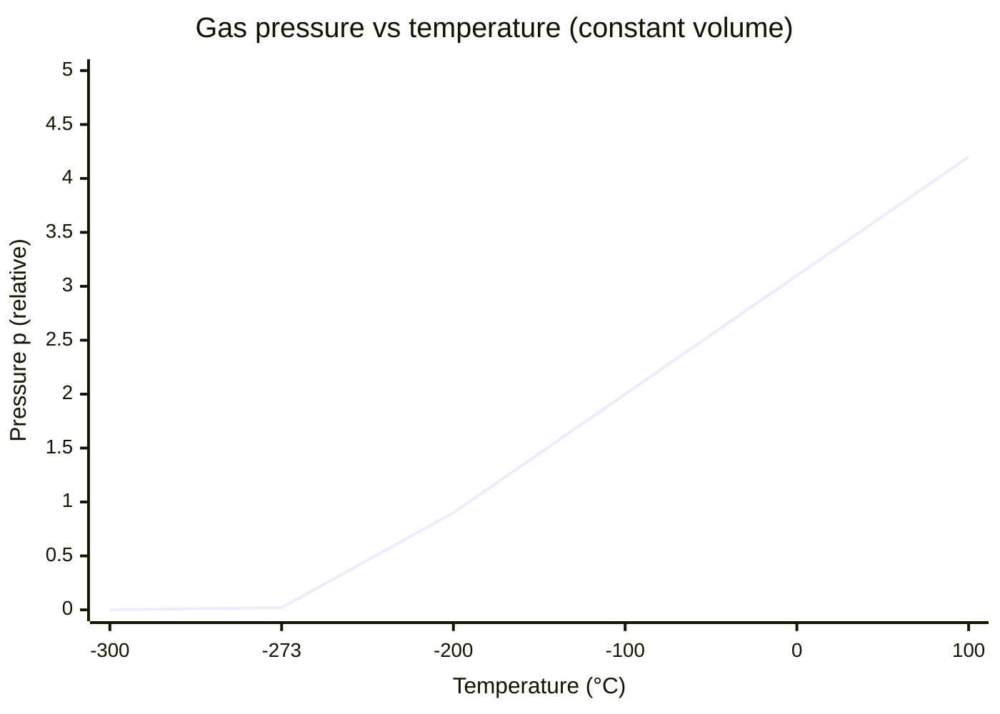

# Absolute Zero

## Core Idea

Absolute zero is the lowest possible temperature, 0 K (−273.15 °C), at which particles have the minimum possible internal energy.

## Meaning

Absolute zero is the zero point of the thermodynamic ([[Temperature]]) scale. At 0 K the random kinetic energy of particles is at its minimum — classically pictured as particle motion ceasing, though quantum mechanics retains a small irreducible zero-point energy. It is the temperature at which the volume (or pressure) of an ideal gas would extrapolate to zero.

It cannot actually be reached: it is an unattainable limiting temperature that experiments can approach but never achieve.

## Everyday Intuition

Cooling a gas at constant pressure shrinks it. If you plot volume against Celsius temperature for a fixed mass of gas at constant pressure, the straight line, extrapolated back, always crosses zero volume at the same point — about −273 °C — regardless of the gas. This common intercept *is* absolute zero, and motivates the kelvin scale.

## GCSE Foundation

- GCSE gas behaviour: gases contract on cooling
- [[Temperature]]

## Why It Matters

Defining 0 K at absolute zero makes the [[Ideal-Gas-Equation]] $pV = nRT$ linear and proportional: at constant pressure, volume is directly proportional to *thermodynamic* temperature only when temperature is measured from absolute zero. Using Celsius would break the proportionality. It also fixes the meaning of [[Internal-Energy]] as energy measured from this minimum.

## Related Quantities

- [[Temperature]]
- [[Pressure]]
- [[Internal-Energy]]

## Related Laws or Results

- [[Ideal-Gas-Equation]]

## Related Models

- [[Ideal-Gas-Model]]
- [[Kinetic-Theory-of-Gases]]

## Representations

- Pressure–temperature (or volume–temperature) graph for a fixed gas mass; the line extrapolates to the temperature axis at −273.15 °C

## Experiments or Observations

- Constant-volume gas thermometer; extrapolation of $p$ against $\theta$ to find the intercept

## Applications

- Cryogenics, superconductivity, low-temperature physics

## Frontier Links

- Third law of thermodynamics; laser cooling and Bose–Einstein condensates (orientation only, beyond A-Level)

## Common Mistakes

- [[Confusing-Heat-and-Temperature]]
- Stating absolute zero as exactly −273 °C rather than −273.15 °C

## Visuals

### Pressure–temperature extrapolation to absolute zero

*Figure: Pressure of a fixed gas mass at constant volume plotted against Celsius temperature. The straight line, when extrapolated, reaches zero pressure at −273 °C — this intercept defines absolute zero (0 K).*
*Source: Authored for this vault (CC0). No external copyright.*

### From Wikipedia

<!-- wiki-images: yes -->

#### CelsiusKelvin

![[_attachments/04_Concepts/Absolute-Zero--wiki-celsiuskelvin.svg]]
*Figure: from Wikipedia article "Absolute zero".*
*Source: Wikimedia Commons — [CelsiusKelvin.svg](https://commons.wikimedia.org/wiki/File:CelsiusKelvin.svg). Retrieved 2026-05-20.*

#### Boomerang nebula

![[_attachments/04_Concepts/Absolute-Zero--wiki-boomerang-nebula.jpg]]
*Figure: from Wikipedia article "Absolute zero".*
*Source: Wikimedia Commons — [Boomerang nebula.jpg](https://commons.wikimedia.org/wiki/File:Boomerang_nebula.jpg). Retrieved 2026-05-20.*

#### Bose Einstein condensate

![[_attachments/04_Concepts/Absolute-Zero--wiki-bose-einstein-condensate.png]]
*Figure: from Wikipedia article "Absolute zero".*
*Source: Wikimedia Commons — [Bose Einstein condensate.png](https://commons.wikimedia.org/wiki/File:Bose_Einstein_condensate.png). Retrieved 2026-05-20.*

## Source Trace

- Source: OpenStax College Physics; HyperPhysics; The Physics Classroom — paraphrased, no copied text
- Section/Page: OCR alignment: [[OCR-Physics-A-H556-Specification]] (Module 5.1.3)
