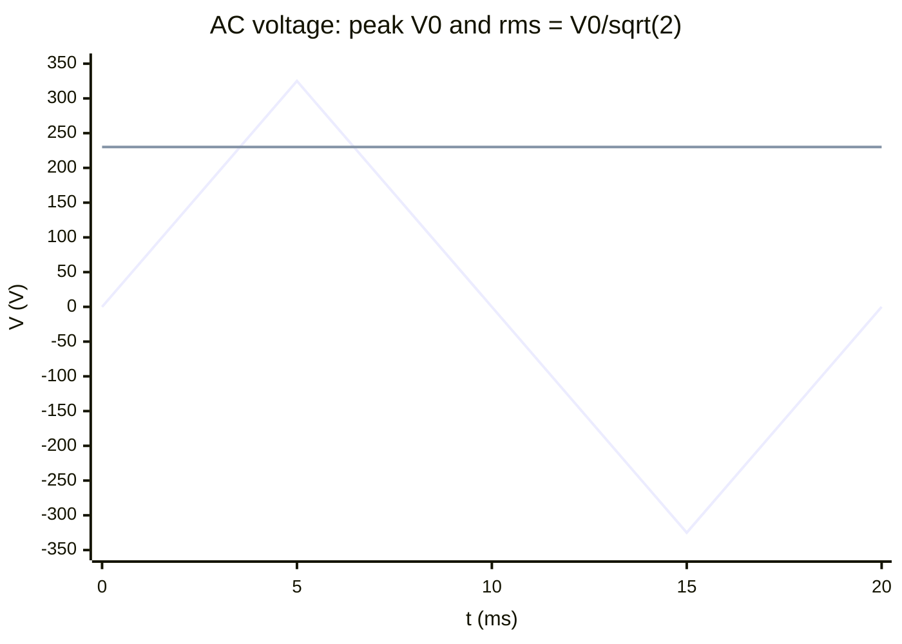

# Alternating Current

## Core Idea

In an **alternating current (AC)** circuit the [[Current]] and [[Potential-Difference]] vary sinusoidally with time, periodically reversing direction:

$$I(t) = I_{0}\sin(2\pi f t), \qquad V(t) = V_{0}\sin(2\pi f t)$$

The "size" of an AC signal for power-delivery purposes is its **root-mean-square** value, not its peak.

## Meaning

Symbols and units:

- $I(t), V(t)$ — instantaneous current (A) and voltage (V).
- $I_{0}, V_{0}$ — **peak** current and voltage; $V_{0}$ is the maximum of $V(t)$ on an oscilloscope trace.
- $f$ — frequency in hertz (Hz). UK mains: $f = 50\,\text{Hz}$.
- $T = 1/f$ — period in seconds (s). UK mains: $T = 20\,\text{ms}$.

The mean of a sinusoid over a full cycle is zero, so peak alone does not characterise heating or power.

## R.M.S. value — the DC-equivalent

The r.m.s. value is the steady DC current/voltage that would dissipate the **same average power** in the same resistor.

$$I_{\text{rms}} = \frac{I_{0}}{\sqrt{2}}, \qquad V_{\text{rms}} = \frac{V_{0}}{\sqrt{2}}$$

Average power in a resistor $R$:

$$\bar{P} = I_{\text{rms}}\,V_{\text{rms}} = I_{\text{rms}}^{2}\,R = \frac{V_{\text{rms}}^{2}}{R}$$

UK mains is **230 V r.m.s.**, so the peak voltage is $V_{0} = 230\sqrt{2}\approx 325\,\text{V}$. Insulation must withstand the peak, not the r.m.s.

Conditions: the $1/\sqrt{2}$ factor applies only to **pure sinusoids**. Square or triangular waves have different ratios.

## Everyday Intuition

A 60 W "230 V" bulb dissipates 60 W on average. A DC supply of 230 V would do exactly the same — that is what r.m.s. means. The bulb does briefly run hotter at the peaks, but its thermal inertia averages it out.

## GCSE Foundation

- [[Current]] and [[Potential-Difference]] — direction and definitions.
- [[Power]] — $P = IV$ for DC carries over to AC with r.m.s. values.

## Why It Matters

- Mains electricity worldwide is AC; voltages are always quoted as r.m.s.
- [[Transformers]] only work with AC because they rely on a changing magnetic flux ([[Faradays-Law]]).
- AC is generated by rotating coils in magnetic fields and is the natural output of [[Electromagnetic-Induction]].

## Representations

- $V$–$t$ sinusoid with peak $V_{0}$ and period $T$ labelled (oscilloscope screen).
- Horizontal lines at $\pm V_{\text{rms}} = \pm V_{0}/\sqrt{2}$ to compare with DC equivalent.

## Experiments — using an oscilloscope

1. Connect AC supply across the Y-input; set time-base and Y-gain so 1–2 cycles fill the screen.
2. Read peak voltage: $V_{0} = (\text{vertical divisions to peak})\times(\text{volts/division})$.
3. Read period: $T = (\text{horizontal divisions per cycle})\times(\text{time/division})$; then $f = 1/T$.
4. Compute $V_{\text{rms}} = V_{0}/\sqrt{2}$.

A multimeter set to "AC V" displays $V_{\text{rms}}$ directly (calibrated for sinusoids).

## Related Concepts and Laws

- [[Current]], [[Potential-Difference]], [[Power]]
- [[Faradays-Law]], [[Electromagnetic-Induction]]
- [[Transformers]], [[The-DC-Motor]], [[Magnetic-Flux-Density]]

## Common Mistakes

- Using peak values in $P = IV$ instead of r.m.s. (gives double the true average power).
- Confusing peak-to-peak with peak: $V_{\text{pp}} = 2V_{0}$.
- Quoting mains as 230 V peak (it is 230 V r.m.s., ~325 V peak).
- Applying $I_{\text{rms}} = I_{0}/\sqrt{2}$ to non-sinusoidal waveforms.

## Visuals

### Sinusoidal voltage with peak and r.m.s.

*Figure: Sinusoid (peak ±325 V) with r.m.s. level (230 V) marked as the DC-equivalent.*
*Source: Authored for this vault (CC0). No external copyright.*

### From Wikimedia

<!-- wiki-images: yes -->

#### AC sine wave on an oscilloscope
![[_attachments/04_Concepts/Alternating-Current--wiki-sine-oscilloscope.jpg]]
*Figure: a real sinusoidal AC signal displayed on an analogue oscilloscope, from which peak voltage and period are read.*
*Source: Wikimedia Commons — [Sine wave 10 kHz displayed on analog oscilloscope.jpg](https://commons.wikimedia.org/wiki/File:Sine_wave_10_kHz_displayed_on_analog_oscilloscope.jpg) — CC BY-SA 4.0 — Pittigrilli. Retrieved 2026-06-27.*

## Source Trace

- Source: [[AQA-Physics-7407-7408-Specification]] §3.7.5.5
- Public reference: HyperPhysics (AC Circuits / RMS Values); OpenStax College Physics, Ch. 20.5.
