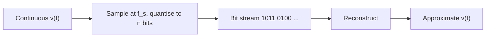

# Analogue and Digital Signals

## Core Idea

An **analogue signal** varies continuously in time and amplitude; a **digital signal** takes only a fixed set of discrete levels — usually just two, called 0 and 1.

## Meaning

Most physical quantities (sound pressure, temperature, light intensity) vary smoothly. A sensor that produces a voltage proportional to that quantity outputs an analogue signal $v(t)$. Any value within its range is allowed.

A digital signal carries information as a sequence of discrete symbols. In a two-level (binary) system, the voltage sits near $V_{0}$ (representing logic 0) or near $V_{1}$ (representing logic 1). The exact voltage between these levels does not matter, only which level it is closest to.

**Why digital wins for transmission and processing:**

- **Noise immunity.** Small voltage noise rarely flips a 0 into a 1, because the gap between the levels is wide. An analogue signal absorbs every bit of noise added to it.
- **Regeneration.** A digital repeater can re-decide each bit and re-transmit a clean copy, so the signal does not degrade over long links. Analogue signals lose quality at every stage.
- **Processing.** Digital signals can be stored, compressed, encrypted, and processed by software running on logic circuits ([[Combinational-and-Sequential-Logic]]).

**Sampling.** To convert analogue to digital, the signal $v(t)$ is measured at regular intervals $T_{s}$. The **sampling frequency** is $f_{s} = 1/T_{s}$ (Hz). Each measurement is then quantised to the nearest of $2^{n}$ levels and stored as an $n$-bit number.

Symbols:

- $v(t)$: instantaneous analogue voltage (V)
- $T_{s}$: sampling period (s)
- $f_{s}$: sampling frequency (Hz)
- $n$: number of bits per sample (dimensionless)

Conditions: faithful reconstruction requires $f_{s}$ to be greater than twice the highest frequency present in the signal (the Nyquist condition).

## Everyday Intuition

A vinyl record stores sound as a continuously varying groove (analogue). A CD stores sound as a stream of numbers (digital). Copy a vinyl onto tape and the noise gets worse each time; copy a CD onto a hard drive and every copy is identical.

## GCSE Foundation

- [[Potential-Difference]]
- [[Alternating-Current]]

## Why It Matters

Almost every modern communication system — phones, Wi-Fi, internet, broadcast — converts analogue inputs into digital bit streams for transmission and back to analogue for human senses. Understanding the digital advantage explains why this conversion is universal.

## Related Quantities

- [[Potential-Difference]]
- [[Current]]

## Related Laws or Results

- Sampling/Nyquist criterion (qualitative at A-Level).

## Related Models

- [[Ideal-Operational-Amplifier]] — analogue amplification stage before sampling.

## Representations

- [[Velocity-Time-Graph]] style time-domain plots, contrasted with discrete sample plots.
- [[Logic-Gate-Diagram]]

## Experiments or Observations

- Use an oscilloscope to compare a sine wave (analogue) and a square wave (digital) on the same screen.

## Applications

- [[Signal-Processing]]
- [[Communication-Systems]]
- [[Combinational-and-Sequential-Logic]]

## Frontier Links

- [[Semiconductor-Physics-Map]]

## Common Mistakes

- Believing digital signals are "perfect" — they only tolerate noise up to the level gap; beyond that bits flip.
- Sampling too slowly and getting **aliasing** — fast features look like slow ones.
- Confusing the **number of bits per sample** (resolution) with the **sampling frequency** (rate).

## Visuals

### Analogue vs digital encoding of the same shape

*Figure: analogue input becomes a quantised bit stream and is reconstructed at the far end.*
*Source: Authored for this vault (CC0). No external copyright.*

## Source Trace

- Source: [[AQA-Physics-7407-7408-Specification]] §3.13
- Public source: HyperPhysics; All About Circuits
- Section/Page: Electronics — analogue and digital signals
