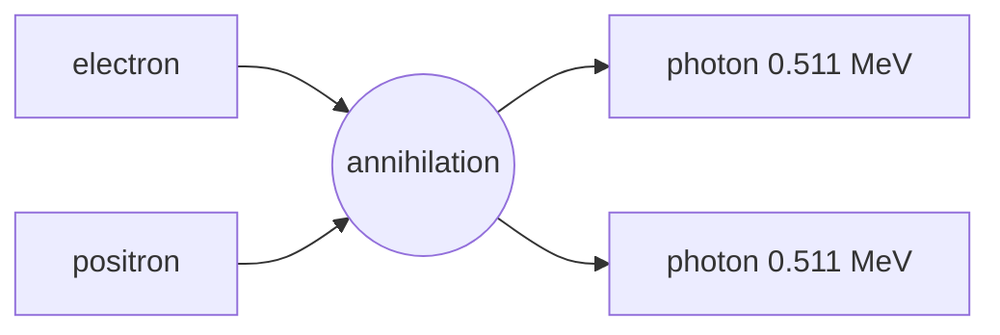

# Annihilation and Pair Production

## Core Idea

A particle and its antiparticle can annihilate to produce photons, and a single high-energy photon can create a particle–antiparticle pair. Both processes are direct expressions of mass–energy equivalence and obey the conservation of energy, momentum, and charge.

## Meaning

**Annihilation.** When a particle meets its antiparticle, both rest masses are converted into electromagnetic energy. The standard example is a slow electron meeting a slow positron:

$$e^{-} + e^{+} \rightarrow \gamma + \gamma$$

Two photons are produced (not one), so that momentum can be conserved when the initial pair is essentially at rest. Each photon carries the rest energy of one particle: $E_{\gamma} = m_{e}c^{2} = 0.511\ \text{MeV}$.

**Pair production.** The reverse process: a single photon converts into a particle–antiparticle pair, e.g.

$$\gamma \rightarrow e^{-} + e^{+}$$

This must happen near a nucleus so that momentum can be conserved (a single photon in free space cannot turn into massive particles by itself). The minimum photon energy needed — the threshold — is twice the rest energy of the particle produced:

$$E_{\min} = 2 m c^{2} \qquad\Rightarrow\qquad hf_{\min} = 2 m c^{2}$$

For an electron–positron pair, $E_{\min} = 1.022\ \text{MeV}$.

In both equations: $h$ is Planck's constant, $f$ is photon frequency, $c$ is the speed of light, $m$ is the rest mass of the particle (or antiparticle) created, and $E_\gamma = hf$ is the photon energy.

## Everyday Intuition

Annihilation is matter "cashing in" its rest energy for light. Pair production is the opposite: enough light energy can crystallise into matter (and equal antimatter).

## GCSE Foundation

- [[Atomic-Structure]]
- [[Charge]]
- [[Mass]]

## Why It Matters

These processes underlie [[PET-Scanning]] (annihilation photons are detected in coincidence), high-energy cosmic-ray physics (pair production in the atmosphere), and particle physics generally. They also demonstrate that conservation of charge, lepton number, momentum, and energy hold simultaneously.

## Related Quantities

- [[Photon-Energy]] — $E = hf$.
- [[The-Electronvolt]] — convenient energy unit at this scale.
- [[Mass]]

## Related Laws or Results

- [[Conservation-of-Energy]]
- [[Conservation-of-Momentum]]
- Mass–energy equivalence, $E = mc^{2}$.

## Related Models

- [[The-Standard-Model]]

## Representations

- [[Feynman-Diagram]]

## Experiments or Observations

- Cloud-chamber tracks of $e^{-}/e^{+}$ pairs created by gamma rays (Anderson, 1933).
- Coincident 511 keV photons in PET scanners.

## Applications

- [[PET-Scanning]]
- Detection of antimatter in cosmic rays.

## Frontier Links

- [[Particle-Physics-Map]] — colliders use pair production to study new heavy particles.

## Common Mistakes

- Producing just one photon in annihilation. Two are needed to conserve momentum.
- Forgetting the factor of 2 in the threshold: $E_{\min} = 2 m c^{2}$, not $m c^{2}$.
- Using MeV without converting when comparing to photon energy in joules ($1\ \text{MeV} = 1.602\times10^{-13}\ \text{J}$).
- Saying pair production can occur in a perfect vacuum from a single photon. It cannot; another body (usually a nucleus) is needed to absorb recoil momentum.

## Visuals

*Figure: Slow electron-positron annihilation produces two back-to-back gamma photons.*
*Source: Authored for this vault (CC0). No external copyright.*

### From Wikimedia

<!-- wiki-images: yes -->

#### PET scan of a normal brain
![[_attachments/04_Concepts/Annihilation-and-Pair-Production--wiki-pet-normal-brain.jpg]]
*Figure: a PET image of a healthy brain; the colours map where a positron-emitting tracer accumulated, located by detecting the back-to-back 511 keV photons from electron-positron annihilation.*
*Source: Wikimedia Commons — [PET Normal brain.jpg](https://commons.wikimedia.org/wiki/File:PET_Normal_brain.jpg) — Public domain — US National Institute on Aging, Alzheimer's Disease Education and Referral Center. Retrieved 2026-06-27.*

## Source Trace

- Source: [[AQA-Physics-7407-7408-Specification]] §3.2.1.3
- Section/Page: Particles, antiparticles and photons — annihilation and pair production.
- Explanatory reference: HyperPhysics "Pair Production"; OpenStax College Physics §33.4 (no text copied).
