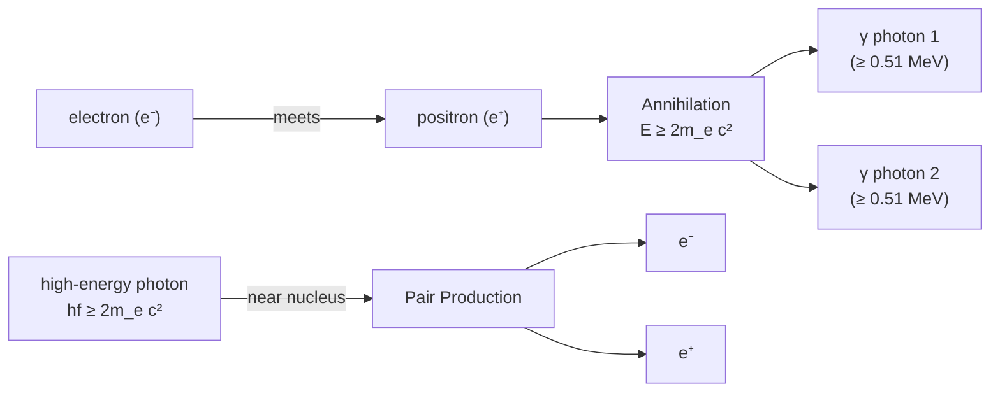

# Antiparticles

## Core Idea

Every particle has an antiparticle with the same mass but opposite charge (and opposite quantum numbers such as baryon or lepton number).

## Meaning

For each particle there is an antiparticle: the electron's antiparticle is the **positron** (e⁺, charge +e, same mass as the electron); the proton's is the antiproton; the neutrino's is the antineutrino. A few neutral particles (e.g. the photon) are their own antiparticle.

Two key processes:

- **Annihilation**: a particle meets its antiparticle and their mass is converted entirely into energy, usually as photons. For electron–positron annihilation, two gamma photons are produced (to conserve momentum), each of minimum energy equal to the rest energy of an electron, ≈ 0.51 MeV.
- **Pair production**: a sufficiently energetic photon (energy $\geq 2mc^2$ of the pair) converts into a particle–antiparticle pair near a nucleus, the reverse of annihilation.

These are direct demonstrations of [[Mass-Energy-Equivalence]] ($E = mc^2$). Antiparticles are emitted in beta-plus decay (a positron and a neutrino).

## Everyday Intuition

An antiparticle is a particle's "mirror twin" in charge. When the twins meet, they cancel and release their stored mass as a flash of energy.

## GCSE Foundation

- [[Atomic-Structure]]

## Why It Matters

Annihilation underlies PET (positron emission tomography) medical scanning, and pair production/annihilation are standard $E = mc^2$ exam contexts.

## Related Quantities

- [[Mass]]
- [[Energy-Quantity|Energy]]

## Related Laws or Results

- [[Mass-Energy-Equivalence]]
- [[Conservation-of-Momentum]]

## Related Models

- [[The-Standard-Model]]

## Representations

- Annihilation and pair-production reaction equations

## Experiments or Observations

- Gamma photons from electron–positron annihilation (PET)

## Applications

- [[Particle-Physics-Map]]

## Frontier Links

- [[Particle-Physics-Map]]
- [[CERN-Science]]

## Common Mistakes

- Thinking an antiparticle has negative mass (mass is the same; charge is opposite)
- Forgetting two photons are needed in annihilation (momentum conservation)
- Using only one rest energy instead of $2mc^2$ for the photon-energy threshold in pair production

## Visuals

### Annihilation and pair-production chain

*Figure: Annihilation converts an electron–positron pair into two gamma photons (momentum conservation requires two); pair production is the reverse, requiring a photon of energy at least $2m_e c^2$.*
*Source: Authored for this vault (CC0). No external copyright.*

## Source Trace

- Source: OpenStax College Physics; HyperPhysics; CERN educational material — no copied text
- OCR alignment: [[OCR-Physics-A-H556-Specification]]
