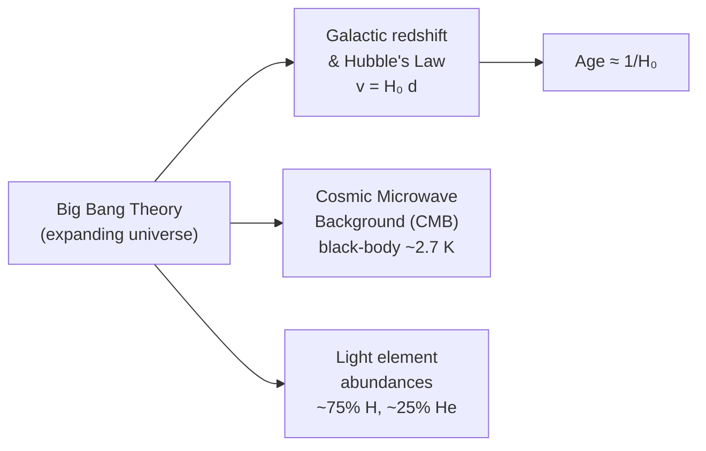

# Big Bang Theory

## Core Idea

The Big Bang theory states that the Universe began in an extremely hot, dense
state and has been expanding and cooling ever since. It is the standard model
explaining the observed expansion and the cosmic microwave background.

## Meaning

The theory does not describe an explosion *in* space; it describes space
itself expanding, carrying galaxies apart. Three main pieces of A-Level
evidence support it:

1. **Galactic redshift and [[Hubbles-Law]].** Almost all galaxies show
   [[Redshift]], and recession speed v is proportional to distance d
   ($v = H_0 d$). This is exactly what a uniformly expanding Universe predicts,
   and running the expansion backwards points to a hot dense origin.
2. **Cosmic microwave background (CMB) radiation.** A faint, almost uniform
   microwave glow fills the sky with a black-body spectrum peaking in the
   microwave region (≈ 2.7 K). It is interpreted as relic radiation from the
   early hot Universe, now greatly redshifted and cooled — analysed using
   [[Wiens-Displacement-Law]].
3. **Relative abundance of light elements** (about three-quarters hydrogen,
   one-quarter helium by mass) matches predictions of nucleosynthesis in the
   early Universe.

The Hubble constant H₀ also gives a rough **age of the Universe** as
approximately $1 / H_0$ (assuming a roughly constant expansion rate).

## Everyday Intuition

Imagine dots on a balloon being inflated: every dot moves away from every
other, and the farther apart two dots are, the faster they separate — no dot
is the centre.

## GCSE Foundation

- [[Wavelength]]
- [[Redshift]]

GCSE introduces red-shift evidence for an expanding Universe. A-Level adds
the CMB, light-element abundance and age $\approx 1/H_0$.

## Why It Matters

The Big Bang model ties together redshift, Hubble's law and the CMB into one
coherent picture and is the framework for all of A-Level cosmology.

## Related Quantities

- [[Wavelength]]
- [[Luminosity]]

## Related Laws or Results

- [[Hubbles-Law]]
- [[Wiens-Displacement-Law]]
- [[Stefans-Law]]

## Related Models

- [[Stellar-Evolution]]

## Representations

- Recession-speed vs distance graph (gradient = H₀)
- Black-body CMB spectrum peaking in the microwave region

## Experiments or Observations

- Galaxy redshift surveys
- CMB measurements (black-body spectrum, near isotropy)

## Applications

- Estimating the age of the Universe from H₀

## Frontier Links

- [[Cosmology-Map]]

## Common Mistakes

- Picturing an explosion into pre-existing space rather than expanding space
- Treating 1/H₀ as the exact age (it is an estimate)
- Thinking the Milky Way is the centre of expansion

## Visuals

### Three lines of evidence for the Big Bang

*Figure: The Big Bang theory is supported by three independent lines of evidence: galactic redshift obeying Hubble's Law, the CMB black-body radiation, and the observed hydrogen/helium ratio from primordial nucleosynthesis.*
*Source: Authored for this vault (CC0). No external copyright.*

## Source Trace

- Source: OpenStax College Physics; HyperPhysics; NASA educational material — no copied text
- OCR alignment: [[OCR-Physics-A-H556-Specification]]
- Section/Page: OCR M5.5 Astrophysics and cosmology
