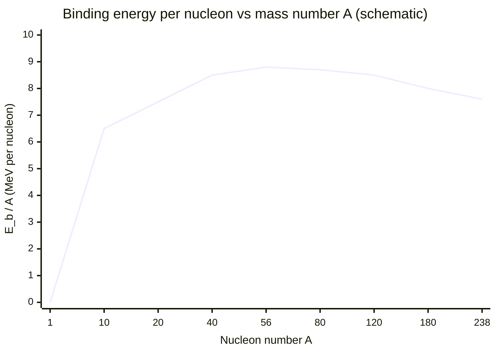

# Binding Energy

## Core Idea

Binding energy is the energy that would be needed to completely separate a nucleus into its individual protons and neutrons; equivalently, it is the energy released when those nucleons come together to form the nucleus.

## Meaning

A bound nucleus has less mass than the sum of its separate nucleons — this missing mass is the [[Mass-Defect]] Δm. By [[Mass-Energy-Equivalence]], the binding energy is:

E_b = Δm c²

where c = 3.00 × 10⁸ m s⁻¹. Binding energies are large, so they are usually quoted in MeV (1 MeV = 1.60 × 10⁻¹³ J), and masses in atomic mass units (1 u → 931.5 MeV).

The most useful quantity is **binding energy per nucleon**, E_b / A. Plotted against nucleon number A, this curve rises steeply for light nuclei, peaks near iron-56 (≈ 8.8 MeV per nucleon — the most stable region), then falls slowly for heavy nuclei.

- Moving toward the peak releases energy.
- Light nuclei joining → [[Nuclear-Fusion]] releases energy.
- Heavy nuclei splitting → [[Nuclear-Fission]] releases energy.

## Everyday Intuition

Binding energy is the "glue cost" of the nucleus: pulling the nucleons apart needs an energy input, so the assembled nucleus sits in an energy well.

## GCSE Foundation

- [[Atomic-Structure]]

## Why It Matters

The binding-energy-per-nucleon curve explains why both fusion (light nuclei) and fission (heavy nuclei) release energy, and lets you calculate energy output of nuclear reactions.

## Related Quantities

- [[Mass]]
- [[Energy]]

## Related Laws or Results

- [[Mass-Energy-Equivalence]]
- [[Conservation-of-Energy]]

## Related Models

- [[The-Nuclear-Atom]]

## Representations

- Binding energy per nucleon vs nucleon number curve (peak near iron)

## Experiments or Observations

- Mass-spectrometer nuclear mass measurements

## Applications

- [[Nuclear-Fission]]
- [[Nuclear-Fusion]]

## Frontier Links

- [[Particle-Physics-Map]]

## Common Mistakes

- Confusing total binding energy with binding energy per nucleon
- Thinking the highest binding-energy nucleus is the heaviest (it is near iron-56)
- Forgetting to convert u to MeV (×931.5) or MeV to J

## Visuals

### Binding energy per nucleon vs nucleon number

*Figure: Binding energy per nucleon rises steeply for light nuclei, peaks near iron-56 (≈ 8.8 MeV/nucleon — most stable), then falls slowly for heavy nuclei. Fusion moves light nuclei toward the peak (releases energy); fission moves heavy nuclei toward the peak (also releases energy).*
*Source: Authored for this vault (CC0). No external copyright.*

## Source Trace

- Source: OpenStax College Physics; HyperPhysics; CERN educational material — no copied text
- OCR alignment: [[OCR-Physics-A-H556-Specification]]
