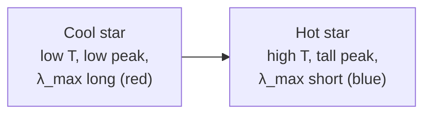

# Black-Body Radiation

## Core Idea

A **black body** is an idealised object that absorbs *all* electromagnetic radiation that falls on it, and emits a characteristic continuous spectrum that depends only on its temperature `T`.

## Meaning

A perfect black body has emissivity 1 and reflectance 0. The radiation it emits is called black-body (or thermal) radiation, and its [[Intensity]] vs wavelength curve has a single peak that shifts to shorter wavelengths as `T` rises. Real stars are not perfect black bodies, but their continuous spectra are well approximated by black-body curves at an "effective temperature".

Two laws describe the curve quantitatively:

- [[Wiens-Displacement-Law]]: `λ_max × T = 2.898 × 10⁻³ m K` — peak wavelength `λ_max` is inversely proportional to `T`.
- [[Stefans-Law]]: `P = σ A T⁴` — total power radiated per unit area scales as `T⁴`, where `σ = 5.67 × 10⁻⁸ W m⁻² K⁻⁴`.

For a star treated as a sphere of radius `R`, this gives [[Luminosity]] `L = 4π R² σ T⁴`.

## Everyday Intuition

Heat a metal rod: dull red glow → orange → yellow → white-hot as it gets hotter. The colour shifts because the peak of the emitted spectrum slides toward shorter wavelengths — this is exactly the black-body behaviour.

## GCSE Foundation

- [[Electromagnetic-Spectrum]]
- [[Temperature]]
- [[Intensity]]

## Why It Matters

- Lets us extract a star's surface temperature from its spectrum's **peak wavelength** (Wien).
- Lets us combine temperature with measured radius to get [[Luminosity]] (Stefan).
- Underpins the OBAFGKM colour sequence: [[Stellar-Spectral-Classes]].
- Cosmic microwave background radiation has a near-perfect black-body spectrum at `T ≈ 2.7 K`, supporting the [[Big-Bang-Theory]].

## Related Quantities

- [[Luminosity]]
- [[Intensity]]
- [[Wavelength]]
- [[Temperature]]

## Related Laws or Results

- [[Wiens-Displacement-Law]]
- [[Stefans-Law]]

## Related Models

- Cavity radiator (ideal black body).
- Star as a uniform-temperature sphere.

## Representations

- Spectral intensity vs wavelength curves at different `T`.
- [[Hertzsprung-Russell-Diagram]] (uses effective temperature).

## Experiments or Observations

- Stellar photometry through coloured filters to estimate `T`.
- Laboratory black-body cavities (Leslie's cube and similar).

## Applications

- Estimating surface temperatures of stars from peak wavelength.
- Inferring stellar radii by combining [[Luminosity]] and `T`.
- Cosmic microwave background analysis.

## Frontier Links

- Planck's quantisation of energy was introduced to explain the black-body curve and resolve the "ultraviolet catastrophe" — see [[Energy-Levels]] and the quantum-mechanics map.
- The CMB connects to [[Big-Bang-Theory]] and modern cosmology.

## Common Mistakes

- Thinking a black body must look black — it can be very bright; "black" means it does not reflect.
- Confusing the peak wavelength with the only wavelength emitted — black bodies emit a continuous spectrum.
- Forgetting that `T` must be in kelvin in both Wien and Stefan laws.
- Treating a real star as exactly a black body; absorption lines from cooler outer layers modify the spectrum.

## Visuals

### Black-body curve shifting with temperature

*Figure: As `T` rises the spectrum's peak grows taller and shifts to shorter wavelengths.*
*Source: Authored for this vault (CC0). No external copyright.*

## Source Trace

- Source: [[AQA-Physics-7407-7408-Specification]] §3.9.2
- Section/Page: Stars as black bodies; use of Wien and Stefan laws.
- Public reference: HyperPhysics "Blackbody Radiation"; NASA IMAGINE the Universe; OpenStax Astronomy Ch. 17.
